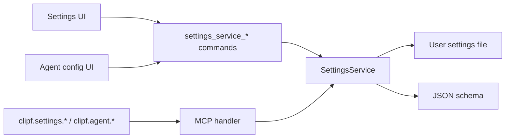
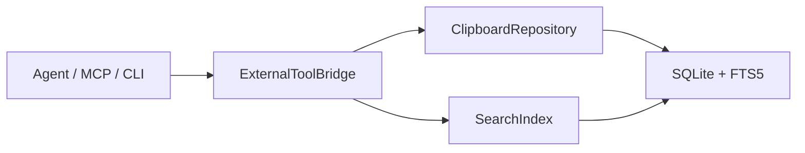

# 服务接口契约

ClipForge 的外部能力通过标准服务接口暴露，后续同步、导入导出、CLI 或 MCP server 都应复用这些契约，而不是绕过数据层直接改 UI 状态。

接口定义在：

```text
src/services/contracts.ts
src/services/example.ts
```

## 写入剪贴板数据

```ts
await repository.capture({
  content: "https://github.com/embaobao/clipforge",
  source: "clipboard",
  sourceLabel: "Clipboard",
  observedAt: Date.now(),
});
```

返回值会说明本次写入是新建、提升已有记录，还是被忽略：

```ts
type ClipboardCaptureResult = {
  status: "created" | "promoted" | "ignored";
  item?: ClipRecord;
  reason?: string;
};
```

## 检索剪贴板数据

```ts
await repository.query({
  text: "github",
  bucket: "all",
  limit: 50,
  sort: "recent",
});
```

查询必须支持分页：

```ts
type ClipQueryResult = {
  items: ClipRecord[];
  nextCursor?: string;
  total?: number;
  indexedAt?: number;
  window: {
    limit: number;
    cursor?: string;
    hasMore: boolean;
  };
};
```

## 软删除

```ts
await repository.delete(["clip_id"], { soft: true });
```

默认删除策略应该优先软删除，定期清理由配置控制。

## 导入导出

```ts
await repository.export({
  format: "jsonl",
  query: { bucket: "all", limit: 200 },
});
```

```ts
await repository.import({
  format: "json",
  content,
  strategy: "merge",
  sourceLabel: "Manual Import",
});
```

## MCP 工具映射

内测阶段 MCP server 统一使用 `clipf.*` 工具名：

- `clipf.capture`
- `clipf.get`
- `clipf.list`
- `clipf.search`
- `clipf.analyze`
- `clipf.copy`
- `clipf.update`
- `clipf.delete`
- `clipf.export`
- `clipf.import`

MCP 只负责标准调用入口，不应该引入复杂 AI 配置流程。

## 设置服务契约（规划中）

设置窗口、Agent 配置区和 MCP 设置工具应统一到 `SettingsService`。统一的是服务对象、JSON schema、revision、校验、redaction、错误码和写入策略；前端设置页仍通过 Tauri command 调用本机服务，外部 Agent 通过 MCP tools 调用同一服务。



核心对象：

```ts
type SettingsDocument = {
  settings: AppSettings;
  schema?: JsonSchema;
  revision: string;
  updatedAt: number;
  source: "tauri" | "mcp";
  writePolicy: {
    recommendedMode: "patch";
    replaceRequiresConfirmation: true;
    resetRequiresConfirmation: true;
    arrayMerge: "replace";
  };
  warnings: string[];
  redaction: Record<string, string>;
};

type SettingsPatchRequest = {
  patch: Partial<AppSettings>;
  actor: "settings-window" | "mcp" | "agent" | "system";
  reason?: string;
  expectedRevision?: string;
};
```

写入规则：

- 推荐使用 `patch`，只更新变更字段。
- `replace` 和 `reset` 必须带 `confirmed: true`，否则返回明确错误和修复提示。
- 写入成功必须返回 `revision`、`changedPaths`、`updatedAt` 和 `durationMs`。
- MCP 返回不得包含明文 API key；provider 配置必须 redacted。
- `settings.get(includeSchema=false)` 应支持轻量读取，避免重复序列化完整 schema。

计划中的 MCP 工具：

- `clipf.settings.get`
- `clipf.settings.patch`
- `clipf.settings.replace`
- `clipf.settings.reset`
- `clipf.agent.providers`
- `clipf.agent.check`
- `clipf.agent.models`

主面板热路径不接入这些工具或命令。快捷键打开、列表滚动、选中态、搜索、复制/粘贴回写不能同步等待设置 schema、MCP、provider check 或 models。所有可见交互必须在 300ms 内反馈；网络类操作只要求 300ms 内显示 pending/loading/error 状态。

## Agent 快速访问边界

Agent、CLI、MCP server、同步服务都只能通过同一套服务契约访问剪贴板数据：



最低可用能力：

```ts
await bridge.call({
  tool: "clipf.capture",
  input: {
    content: "hello from agent",
    source: "external",
    sourceLabel: "MCP",
    observedAt: Date.now(),
  },
});

await bridge.call({
  tool: "clipf.search",
  input: {
    text: "hello",
    bucket: "all",
    limit: 20,
    sort: "recent",
  },
});
```

约束：

- 外部工具不得直接写 UI state、localStorage 或内存列表。
- 外部工具不得绕过 SQLite/FTS5 主存储。
- 搜索必须有 `limit`，默认不返回全量历史。
- 删除默认软删除，硬清理由配置驱动。
- AI 能力如果接入，只能作为 MCP 工具调用这些接口，不在快捷面板里增加复杂配置。
