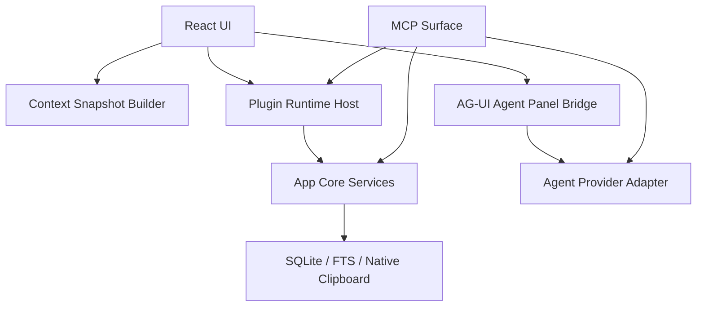

# ClipForge 上下文驱动的插件与 Agent 运行时设计

## 结论

采用分层桥接架构。第一阶段先定义 `ClipboardContextSnapshot`、权限模型、插件 manifest、Editor Session 边界、MCP tools surface、AG-UI Agent Panel Bridge，以及自动升级能力的版本/兼容/回滚机制。

这个设计的核心原则是：ClipForge 仍然是快速剪贴板工具。插件和 Agent 是增强能力，不能阻塞剪贴板监听、快速面板唤起、详情页首屏和复制粘贴主路径。

## 当前能力盘点

当前稳定可用：

- 剪贴板条目正文、创建时间、更新时间、最近出现时间、最近复制时间。
- `kind/payloadKind` 的基础内容分类。
- 标题、摘要、URL、host、Markdown 标记。
- macOS 来源应用名称、bundle id、可执行路径、icon。
- 详情页渲染器、业务链路、路由、内容长度、行数。

当前条件可用：

- 图片、文件、HTML 多数仍是文本推断，不是原生多 MIME 采集。
- 当前输入环境存在于粘贴目标恢复链路和日志中，但不是稳定上下文 API。
- 前端和后端内容分析逻辑还没有统一。

第一阶段必须修正：

- 统一后台监听和显式 capture 的内容分类逻辑。
- 明确字段分级：稳定字段、推断字段、敏感字段、预留字段。
- 默认脱敏 `sourceApp.executablePath`、完整正文、输入框坐标、OCR 文本。

## 分层架构



App Core 是唯一业务真实源。插件、Agent、MCP 都不能直接读写 SQLite、React state、localStorage 或系统剪贴板原生 API。

MCP 是对外稳定工具面，不等于插件系统。AG-UI 是 Agent 与页面之间的事件协议，不承担插件发现和权限授权。

## Context Snapshot Contract

```ts
export type ClipboardContextSnapshot = {
  schemaVersion: 1;
  snapshotId: string;
  createdAt: number;
  clip: {
    id: string;
    contentKind: string;
    payloadKind: string;
    title: string;
    summary: string;
    chars: number;
    lines: number;
    createdAt: number;
    updatedAt: number;
    lastSeenAt: number;
    lastCopiedAt?: number;
  };
  sourceApp?: {
    name: string;
    bundleId?: string;
    iconAvailable: boolean;
    executablePath?: string;
  };
  detail: {
    routePath: "/clip/$clipId";
    renderer: string;
    detailMode: string;
    businessChain: string;
  };
  trigger: {
    surface: "quick-panel" | "detail" | "editor" | "plugin" | "mcp" | "agent-panel";
    action: string;
    userInitiated: boolean;
  };
  editor?: EditorSessionSnapshot;
  permissions: ContextPermissionSnapshot;
  diagnostics: {
    source: "live" | "cached" | "partial";
    missing: string[];
    redacted: string[];
  };
};
```

详情页打开时默认生成只读 snapshot。进入 Tiptap 编辑态后才增加 `editor`。

```ts
export type EditorSessionSnapshot = {
  sessionId: string;
  draftVersion: number;
  mode: "readonly" | "editing";
  dirty: boolean;
  contentFormat: "text" | "markdown" | "html" | "json";
  selectionText?: string;
  readableFields: Array<"text" | "html" | "json" | "selection">;
};
```

## 插件边界

插件是能力单元，可以是内置能力、MCP server、本地 RPC、远程 RPC 或声明式面板。

插件 manifest 声明：

- runtime 类型。
- 允许读取的 context 字段。
- 允许处理的 content type。
- 触发点和按钮。
- 允许输出的 action。
- 是否需要用户确认。
- 兼容的 app 版本、context schema、MCP/AG-UI 版本。

插件输出第一阶段只允许：

- 声明式面板渲染。
- patch preview。
- selection/document 替换建议。
- copy result。
- call Agent。

所有写入动作必须先预览，再由用户确认。

## Agent 边界

Agent 是协作者，不是插件本身。定义统一 `AgentProvider`：

```ts
export type AgentProvider = {
  id: string;
  kind: "local" | "remote" | "acp";
  displayName: string;
  startRun(input: AgentRunInput): AsyncIterable<AgUiEvent>;
  cancelRun(runId: string): Promise<void>;
};
```

本地 Agent、远程 Agent、ACP Agent 都通过 provider adapter 接入，输出统一转为 AG-UI events。详情页只消费 AG-UI 事件，不直接依赖某个 Agent SDK。

## MCP 工具面

建议新增工具：

- `clipboard.context.get`
- `clipboard.plugin.list`
- `clipboard.plugin.call`
- `clipboard.editor.context`
- `clipboard.editor.preview_patch`
- `clipboard.editor.apply_patch`
- `clipboard.agent.run`

MCP 返回值必须带排障字段：`traceId`、`businessChain`、`redactedFields`、`permissionDecision`。

## 自动升级能力

自动升级分四类：

- 应用更新：Tauri updater，签名 artifact，HTTPS endpoint，用户确认安装。
- 内置 manifest 更新：只更新规则、模板、内容识别配置，不执行新代码。
- 插件更新：更新插件 manifest 和外部 MCP/RPC endpoint 版本，需要兼容性检查。
- Agent adapter 更新：更新 provider 配置、模型能力、工具白名单，不静默扩大权限。

升级前检查：

- app 版本是否满足。
- context schema 是否兼容。
- 权限是否扩大。
- 运行时是否可用。
- 是否命中 kill switch 或本地禁用记录。

升级策略：

- 默认不静默安装应用更新。
- manifest 类更新可以后台检查，但应用前写 pending 状态。
- 权限扩大必须用户确认。
- 每个插件和 Agent Provider 都有 kill switch。
- 最近一次可用版本必须保留，升级失败自动回滚。
- 更新检查不能阻塞快速面板启动。

## 错误隔离

- renderer 错误只替换当前渲染区。
- 插件错误只降级插件按钮或插件面板。
- Agent 错误只降级 Agent 面板。
- tab 层不可处理错误只降级当前 tab，不能让应用面板崩溃。

日志必须包含：`traceId`、`surface`、`businessChain`、`clipId`、`payloadKind`、`contextSchema`、`permissionDecision`、`redactedFields`。

## 实施顺序

1. 修正当前上下文字段确定性。
2. 定义 Context Snapshot 和权限模型。
3. 定义插件 manifest 和 action。
4. 定义 Editor Session 边界。
5. 定义 MCP tools surface。
6. 定义 AG-UI Agent Panel Bridge。
7. 定义自动升级 registry、兼容性检查、kill switch、回滚日志。
8. 再进入 Tiptap 编辑器和 Agent 面板实现。

## 自检

- 没有把 MCP、插件、Agent、AG-UI 混成同一层。
- 没有让插件直接访问 UI state 或数据库。
- 没有默认暴露完整正文、可执行路径或输入框坐标。
- 没有让升级检查阻塞快速剪贴板主路径。
- 自动升级先规划边界和安全机制，不承诺第一期静默安装。

