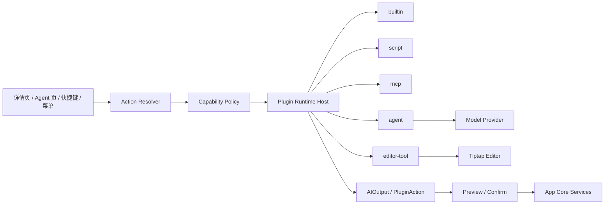

# 设计：AI 模型、详情页增强、插件体系与标品化

## 1. 总体产品定位

ClipForge 的 AI 能力必须围绕剪贴板工具主路径展开：

```text
复制内容 -> 进入历史 -> 搜索/详情/编辑 -> AI 建议或 Agent 处理 -> 预览确认 -> 保存/复制/粘贴
```

AI 不是首页，不是工作台，不是自动化后台。它是剪贴板条目的增强动作层。

因此产品上划分为四个 surface：

| Surface | 用户看到的入口 | 主要任务 |
|---------|----------------|----------|
| 快速面板 | 剪贴板列表、搜索、复制、删除 | 保持低延迟主路径 |
| 详情页 | 查看、编辑、tag、AI 建议 | 对单条内容做精修和保存回填 |
| Agent 页 | 极简聊天框、引用附件、结果动作 | 对一组剪贴板上下文做问答和生成 |
| 插件动作 | 菜单、快捷键、命令、详情按钮 | 把常用处理封装成可复用能力 |

## 2. 模型配置方案

### 2.1 配置对象

模型配置分三层：

```ts
type ModelProviderConfig = {
  providerId: string;
  label: string;
  kind:
    | "local-cli"
    | "openai-compatible"
    | "ai-sdk-provider"
    | "local-server"
    | "tiptap-ai"
    | "custom-plugin";
  baseUrl?: string;
  credentialRef?: string;
  commandTemplate?: string;
  enabled: boolean;
  health: "unknown" | "checking" | "ready" | "failed" | "disabled";
};

type AIModelProfile = {
  profileId: string;
  label: string;
  providerId: string;
  modelId: string;
  purpose:
    | "default-chat"
    | "fast-summary"
    | "editor-rewrite"
    | "structured-extract"
    | "local-private"
    | "vision";
  contextLimit?: number;
  supportsTools: boolean;
  supportsVision: boolean;
  supportsJsonMode: boolean;
  supportsStreaming: boolean;
};

type CapabilityPolicy = {
  allowNetworkModel: boolean;
  allowLocalModel: boolean;
  allowFullClipText: boolean;
  allowMultipleClips: boolean;
  allowFileContent: boolean;
  allowToolCalling: boolean;
  allowCommandExecution: boolean;
  requirePreviewForWrite: true;
};
```

### 2.2 Provider 类型

| 类型 | 例子 | 使用场景 | 风险 |
|------|------|----------|------|
| `local-cli` | `codex`、`claude -p`、用户自定义命令 | 本地 Agent、长任务、已有 CLI 用户 | 命令执行边界必须严格确认 |
| `openai-compatible` | OpenAI、OpenRouter、本地网关 | 最通用的模型接入 | secret 管理、网络隐私 |
| `ai-sdk-provider` | Vercel AI SDK provider registry | 统一 streaming/tool call/message parts | 版本随 SDK 演进 |
| `local-server` | Ollama、LM Studio、vLLM | 私密、本地、低成本 | 能力差异、tool calling 不稳定 |
| `tiptap-ai` | Tiptap Content AI / AI Toolkit | 编辑器内上下文和选区 AI | 需要单独确认授权、版本、付费边界 |
| `custom-plugin` | 插件提供的模型网关 | 企业/私有集成 | 插件权限和审计复杂 |

### 2.3 默认模型路由

配置完成后，默认按用途路由：

| 用途 | 首选 profile | 降级 |
|------|--------------|------|
| 快速总结 | `fast-summary` | `default-chat` |
| 详情页改写 | `editor-rewrite` | `default-chat` |
| 结构化提取 | `structured-extract` | `default-chat`，无 JSON mode 时返回 preview |
| 私密内容 | `local-private` | 提示用户改用本地模型或手动授权网络模型 |
| Agent 聊天 | `default-chat` | 本地 CLI Agent |
| 图片/文件理解 | `vision` | 只使用 metadata，不发送原内容 |

### 2.4 Secret 与配置存储

- React 前端只拿 `providerId/profileId/label/health/capabilities`。
- API key、base URL token、CLI credential 只存原生层安全存储或后端 service，不进入 localStorage。
- 日志只记录 provider/profile id、耗时、token 估计、权限裁剪字段，不记录 prompt 全文和模型输出全文。
- Provider health check 异步执行，不阻塞面板打开。

## 3. 配置好模型后的默认 AI 能力

第一版“配置完成即可用”的标准能力：

| 能力 | 入口 | 输入 | 输出 | 写入策略 |
|------|------|------|------|----------|
| 摘要 | 详情页 / Agent 页 / 插件动作 | 当前 clip 或引用集合 | summary 文本 | 默认新建草稿，不自动覆盖 |
| 改写 | 详情页编辑态 | draft、selection、tone | content patch | preview 后应用到 draft |
| 翻译 | 详情页 / 插件动作 | selection 或全文 | content patch / new clip | preview 后保存 |
| 标签建议 | 详情页 tag 行 | 当前 clip metadata/text | tag patch | 用户确认后写入 |
| 结构化提取 | 详情页 / Agent 页 | JSON、日志、文章、网页片段 | key-value/table/JSON | renderPanel 或 newClipDraft |
| 格式修复 | 详情页 / 插件动作 | JSON/Markdown/code/command | content patch | preview 后应用 |
| 模板生成 | Agent 页 / 插件动作 | 引用集合、用户指令 | newClipDraft | 用户保存后入库 |
| 命令解释 | 详情页 | shell command/code/error | renderPanel | 不自动执行 |
| 插件草稿生成 | Agent 页 | 用户描述、上下文 | plugin draft | 用户确认、校验后保存 |

写入统一收敛到：

```ts
type AIOutput =
  | { kind: "previewPatch"; patch: EditorPatch; riskLevel: "low" | "medium" | "high" }
  | { kind: "newClipDraft"; content: string; tags: string[]; provenance: AgentProvenance }
  | { kind: "copyResult"; content: string; expiresAt?: number }
  | { kind: "renderPanel"; schema: PluginPanelSchema };
```

## 4. 详情页与 Tiptap AI Toolkit 方案

### 4.1 分层原则

详情页编辑分两层：

1. `CompactClipEditor` 是基础能力：纯文本、Markdown 原文、代码、命令、tag、保存回填、AI patch preview。
2. `TiptapClipEditor` 是富文本增强：HTML/Markdown 富文本编辑、选区工具、编辑器内 AI 菜单、Content AI / AI Toolkit 集成。

Tiptap 失败、未授权、未安装或 provider 不可用时，详情页必须自动退回紧凑编辑能力。

### 4.2 Tiptap 适用范围

适合使用 Tiptap AI Toolkit 的能力：

- 基于编辑器 selection 的改写、扩写、缩写、翻译。
- 插入段落、标题、列表、引用等结构化编辑。
- 富文本 HTML 的局部 patch preview。
- 编辑器内 slash command 或 floating menu 式 AI 动作。
- 将 Tiptap tool calls 映射到 ClipForge 的 `editor.preview_patch`。

不适合交给 Tiptap 的能力：

- 剪贴板历史真实存储。
- 系统剪贴板写回。
- 插件权限判断。
- Agent run 生命周期。
- 大范围历史上下文组合。
- 删除、归档、批量管理等 ClipForge 数据操作。

### 4.3 Editor Tool Bridge

Tiptap 编辑器内 AI 工具不能直接修改数据库，而是映射到 ClipForge 编辑器工具：

```ts
type EditorAIToolBridge = {
  readContext(input: {
    sessionId: string;
    includeSelection: boolean;
    includeDocument: boolean;
  }): EditorContextSnapshot;

  previewPatch(input: {
    sessionId: string;
    beforeVersion: number;
    patch: EditorPatch;
    source: "tiptap-ai" | "agent" | "plugin";
  }): PatchPreview;

  applyPreview(input: {
    previewId: string;
    mode: "apply-to-draft" | "save" | "save-and-copy" | "save-and-paste";
  }): SaveResult;
};
```

### 4.4 Markdown 策略

- 第一阶段：Markdown 仍以源码编辑为准，避免 ProseMirror 往返破坏原文。
- 富文本阶段：用户显式切换到富文本模式后，才进行 Markdown -> HTML/ProseMirror -> Markdown 或 HTML 的转换。
- AI patch 必须展示“将从源 Markdown 改成什么”，不能只展示富文本视觉结果。

## 5. 插件体系总模型

### 5.1 插件不是只有外部扩展

ClipForge 插件体系包含所有可复用能力：

| Runtime | 说明 | 例子 |
|---------|------|------|
| `builtin` | 内置能力插件化 | 打开链接、进入详情、JSON 格式化 |
| `script` | 用户脚本或 Agent 生成脚本 | 转换文本、打开终端、生成模板 |
| `mcp` | 外部 MCP server 工具 | issue 创建、文档检索、外部系统写入 |
| `panel` | 返回声明式 UI 面板 | 结构化提取结果、表格预览 |
| `agent` | Agent Provider / Agent Skill / Agent Run | 摘要 Agent、翻译 Agent、代码审查 Agent |
| `editor-tool` | Tiptap 或编辑器内工具 | 改写选区、插入摘要、标签建议 |
| `model-provider` | 模型接入能力 | OpenAI-compatible、本地模型、企业网关 |

### 5.2 Manifest 扩展

在 `context-plugin-agent-runtime` 的 `ClipForgePluginManifest` 基础上扩展：

```ts
type ClipForgePluginManifestV2 = ClipForgePluginManifest & {
  runtime:
    | "builtin"
    | "script"
    | "mcp"
    | "rpc"
    | "panel"
    | "agent"
    | "editor-tool"
    | "model-provider";

  ai?: {
    requiredProfiles?: string[];
    preferredPurpose?: AIModelProfile["purpose"];
    supportsStreaming?: boolean;
    supportsToolCalling?: boolean;
    maxInputChars?: number;
    outputKinds: AIOutput["kind"][];
  };

  agent?: {
    providerId?: string;
    runMode: "chat" | "single-shot" | "workflow" | "background";
    inputSchema: "message" | "context-set" | "editor-session" | "plugin-draft";
    allowedTools: string[];
  };

  editorTool?: {
    surfaces: Array<"compact-editor" | "tiptap-editor" | "detail-preview">;
    selectionRequired: boolean;
    patchMode: "replace-selection" | "replace-document" | "insert" | "metadata-only";
  };

  product?: {
    tier: "core" | "pro-ai" | "plugin-dev" | "team";
    defaultEnabled: boolean;
    userConfigurable: boolean;
    enterpriseControllable: boolean;
  };
};
```

### 5.3 Agent 作为插件能力

Agent 不再被建模为独立平台，而是插件 capability：

```ts
type AgentPluginCapability = {
  kind: "agent";
  providerId: string;
  modelProfileId?: string;
  tools: string[];
  contextPolicy: CapabilityPolicy;
  outputPolicy: {
    allowed: AIOutput["kind"][];
    requirePreview: true;
    defaultTags: ["AI"];
  };
};
```

含义：

- Agent 页是调用 Agent 插件的一个 UI surface。
- 详情页“建议”可以调用 Agent 插件，但输出必须是 patch preview。
- 插件可以调用 Agent 能力，例如 `builtin.summarize-with-agent`。
- Agent 可以生成插件草稿，但保存前必须经过 manifest 校验、权限扩大检测和用户确认。
- Agent run 失败只降级对应插件能力，不影响剪贴板主路径。

### 5.4 插件调用链



## 6. MCP 与外部工具面

标准 MCP tools 建议分层：

| Tool | 说明 |
|------|------|
| `clipboard.context.get` | 读取单条脱敏上下文 |
| `clipboard.context.compose` | 按引用集合组合上下文 |
| `clipboard.content.parse` | 智能解析可复制、可打开、可提取目标 |
| `clipboard.editor.context` | 读取当前编辑器 session |
| `clipboard.editor.preview_patch` | 生成编辑器 patch 预览 |
| `clipboard.editor.apply_patch` | 用户确认后应用 patch |
| `clipboard.ai.run` | 调用已配置模型 profile，返回受控输出 |
| `clipboard.agent.run` | 调用 Agent plugin/provider，返回 run events |
| `clipboard.plugin.list` | 列出可用插件和权限 |
| `clipboard.plugin.call` | 调用插件，返回 preview/output |
| `clipboard.plugin.draft.create` | 创建插件草稿，不自动启用 |
| `clipboard.model.list` | 列出可用 profile，不返回 secret |
| `clipboard.policy.explain` | 解释某次能力调用为什么被允许/拒绝 |

外部工具面只返回结构化结果，不直接操作 React/Tiptap instance。

## 7. 标品化方案

### 7.1 产品包

| 产品包 | 面向用户 | 能力 |
|--------|----------|------|
| Core Clipboard | 所有用户 | 历史、搜索、详情、编辑、复制、删除、基础 tag |
| AI Edit Pack | 个人 Pro | 模型配置、摘要、改写、翻译、标签建议、结构化提取、Tiptap AI 增强 |
| Agent Clip Pack | 高级个人 | Agent 页、引用集合、CLI Agent、结果保存、Agent plugin |
| Plugin Builder Pack | 高级用户/开发者 | 插件草稿、脚本插件、MCP 插件、manifest 校验、插件面板 |
| Local Privacy Pack | 私密场景 | 本地模型、本地 CLI、禁用网络 provider、敏感字段策略 |
| Team Governance Pack | 团队/企业 | provider allowlist、插件签名、审计、策略下发、kill switch |

### 7.2 第一版建议

第一版不需要立刻做商业计费，但要按标品边界组织能力开关：

```ts
type ProductCapabilityGate = {
  capabilityId: string;
  tier: "core" | "pro-ai" | "plugin-dev" | "team";
  enabledByDefault: boolean;
  requiresModel: boolean;
  requiresNetwork: boolean;
  requiresUserConfirmation: boolean;
};
```

这样后续可以自然演进到：

- 免费版只提供基础剪贴板和本地手动编辑。
- Pro 版启用模型 profile、详情页 AI、Agent 页。
- 开发者版启用插件草稿、脚本插件、MCP 扩展。
- 团队版启用统一策略、审计、签名和禁用列表。

## 8. 安全与隐私

必须默认成立：

- AI、Agent、插件都不能直接写数据库，必须经 App Core Services。
- 所有写入历史、系统剪贴板、文件系统、外部 URL、命令执行的动作必须可解释、可预览、可取消。
- 默认只发送摘要和 metadata；发送全文、多条历史、文件内容、图片 OCR 必须单次授权或明确策略允许。
- Agent 生成或 AI 应用保存的内容默认带 `AI` tag 和 provenance。
- 用户手动移除 `AI` tag 后，普通保存不自动加回。
- 企业策略可以禁用 network model、script plugin、command execution、remote MCP。

## 9. 待讨论问题

1. 第一版是否允许用户自带 OpenAI-compatible API key，还是先只支持本地 CLI Agent。
2. Tiptap AI Toolkit 是作为 Pro AI Pack 的必要能力，还是只作为富文本增强的可选 provider。
3. Agent plugin 是否允许后台长任务，还是第一版只允许用户可见 run。
4. 插件草稿由 Agent 生成后，第一版是否允许保存为可执行脚本，还是只保存为手动复制模板。
5. Team Governance Pack 是否需要第一版就保留策略文件格式，还是只保留内部 type。
6. 网络模型默认发送全文是否必须每次确认，还是可以按 provider/profile 设置“信任此 provider”。
7. AI 输出的 `AI` tag 是否只标记生成内容，还是所有 AI 改写过的条目都必须标记。
8. Tiptap 富文本保存格式第一版选择 HTML、Markdown，还是双 representation。
9. 插件市场是否完全排除在第一阶段，还是只保留本地 manifest import/export。
10. 需要支持哪些“标品模板”：日志分析、JSON 修复、Issue 生成、邮件改写、翻译、文章摘要、代码解释。

