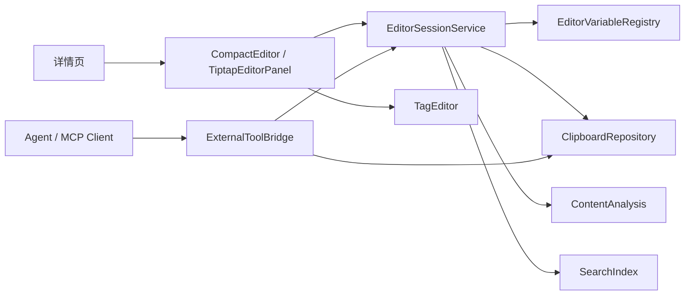

# 提案：详情页富文本编辑器与 Agent/MCP 扩展桥

## 背景

ClipForge 当前详情页已经支持 Markdown / 链接 / 代码块预览，以及代码块快速粘贴，但详情页仍是“查看和动作面板”，不支持直接编辑内容、快速维护 tag、或把 AI 建议以可确认的方式回写到剪贴板历史。

后续如果要引入动态插件脚本、Agent 辅助改写、模板变量、内容转换等能力，必须先有一个受控的编辑会话模型：

- 用户在详情页明确点击“编辑”进入紧凑编辑态。
- 编辑器能读取当前条目、来源应用、内容类型、窗口/路由、最近剪贴板上下文等变量。
- 保存时必须回填到当前剪贴板条目，并可选择同步写回系统剪贴板。
- 用户可以在详情页直接编辑 tag，正文中的 `#xxx` 也可以被识别为 tag 建议。
- Agent 只能返回“智能建议反吐”，由用户预览、确认、应用，不能后台静默改写内容。
- 插件和 Agent 只能通过稳定服务接口访问编辑会话，不直接读写 React UI state。

## 目标

1. 在详情页增加紧凑“编辑”入口，优先支持文本、Markdown、代码、命令的快速修改。
2. 支持详情页快速编辑 tag，并把正文中的 `#xxx` 解析为待确认 tag 建议。
3. 支持“保存并回填”：更新当前 clip 内容、tags、摘要、分析结果、搜索索引，并可一键写回系统剪贴板。
4. 定义 AI 智能建议反吐模型：Agent 返回内容 patch、tag patch、解释和风险提示，用户确认后才应用。
5. 引入 Tiptap 作为后续富文本编辑器基础，优先覆盖 Markdown / HTML 类内容，但不阻塞紧凑纯文本编辑先落地。
6. 定义编辑器变量机制，暴露当前编辑器可获取的环境与变量信息。
7. 为后续插件脚本和 Agent/MCP 对接定义桥接边界与工具名称。

## 非目标

- 不把 ClipForge 改造成 AI 工作台或复杂知识库。
- 不在第一阶段实现远程插件市场、远程代码执行或后台自动改写。
- 不让 Agent 建议绕过用户确认直接保存。
- 不让插件直接访问 SQLite、React store、localStorage 或系统剪贴板原生 API。
- 不默认把全部剪贴板历史暴露给编辑器变量或 Agent。
- 不在第一阶段实现多人协同编辑、评论、云同步或 Tiptap Cloud 能力。

## 用户价值

- 用户复制一段 Markdown、命令、提示词或富文本后，可以在详情页快速修正并直接粘贴。
- 用户可以顺手给条目打 tag，写下 `#客户A`、`#AI` 后能立即在搜索栏按 tag 找回。
- Agent 生成或改写出来的粘贴项会自动带 `AI` tag，后续可以用 `#AI` 或 `tag:AI` 快速过滤。
- 变量机制让模板和插件能明确知道“当前内容是什么、来自哪个应用、当前目标是什么”，减少手工复制上下文。
- Agent/MCP 只作为可选外部能力接入，不影响剪贴板工具的快速主路径。

## 技术调研结论

### Tiptap

根据 Context7 拉取的 Tiptap 当前文档：

- React 接入使用 `@tiptap/react` 的 `useEditor` 和 `EditorContent`。
- 基础扩展可用 `@tiptap/starter-kit`，也可以按需组合 Document / Paragraph / Text 等扩展。
- 编辑器内容可以通过 `editor.getJSON()` 获取结构化文档，通过 `editor.getHTML()` 获取 HTML，通过 `editor.getText()` 获取纯文本。
- 自定义扩展可通过生命周期事件（如 `onUpdate`、`onSelectionUpdate`、`onFocus`、`onBlur`）接入状态同步。
- 自定义扩展支持 `addStorage()` 保存可变运行时数据，适合挂载只读变量 registry 或编辑会话元数据。

结论：Tiptap 适合承担详情页受控富文本编辑器，但 Markdown 原文的高保真往返不是 StarterKit 的内置能力，需要单独设计 Markdown 导入/导出策略。

### MCP/Agent

仓库现有架构已定义：

- MCP 是标准工具入口，不和 UI 状态强耦合。
- Agent、CLI、MCP server 只能通过统一服务契约访问剪贴板数据。
- 当前基础工具包括 `clipboard.capture`、`clipboard.search`、`clipboard.copy`、`clipboard.update` 等。

本提案延续该边界：编辑器会话通过独立 EditorSessionService 暴露，MCP/Agent 调用服务层，不直接操作 React 组件。

## 方案概览

## 交互设计

### 详情页新增动作

- 顶部快捷操作新增“编辑”按钮，进入紧凑编辑态。
- 第一阶段不默认打开复杂富文本工具栏，优先提供正文编辑、tag 行、保存动作和 AI 建议入口。
- 点击后详情页从预览态切换到编辑态，面板尺寸保持稳定，不因为 tag chip 换行抖动。
- 编辑态顶部动作：
  - `保存`：更新当前 clip，停留编辑态。
  - `保存并复制`：更新当前 clip，并写回系统剪贴板。
  - `保存并粘贴`：更新当前 clip，并调用现有粘贴链路。
  - `建议`：调用 Agent 生成智能建议反吐，只进入预览，不直接保存。
  - `取消`：放弃本次编辑，回到预览态。
  - `变量`：打开只读变量抽屉。

### Tag 快速编辑

- 详情页元信息区下方显示紧凑 tag 行。
- tag chip 支持删除，输入框支持输入 `客户A` 或 `#客户A` 后回车添加。
- 正文编辑区检测到 `#xxx` 时，只生成 tag 建议 chip，不自动改正文。
- `AI` 是保留 tag：Agent 生成、Agent 改写并保存、Agent 建议应用后另存的新条目默认带 `AI`。
- 用户手动移除 `AI` tag 后不再被后台自动加回，除非该条目再次由 Agent 生成或改写。

### AI 智能建议反吐

- Agent 返回 `EditorSuggestionResult`，包含内容 patch、tag patch、简短说明、风险提示和建议动作。
- 详情页只展示 diff / tag 变化 / 预期保存动作，用户点击应用后才进入 draft。
- 应用建议只修改当前编辑 draft，不直接写 SQLite、不直接写系统剪贴板。
- 保存时统一走 `save_editor_draft`，确保分析、FTS、tag 索引和日志一起更新。

### 编辑对象

第一阶段支持：

- `payloadKind=text`
- `payloadKind=markdown`
- `payloadKind=html`
- `kind=code` / `kind=command` 走代码/纯文本编辑模式。

暂不支持：

- 图片原图编辑。
- 文件列表编辑。
- RTF 高保真编辑。

## 风险与约束

- Markdown 高保真往返存在风险：Tiptap 原生以 ProseMirror JSON / HTML 为主，Markdown 需要明确转换策略。
- 编辑器 bundle 体积会上升，需要延迟加载编辑器面板，避免影响快速面板首屏。
- 变量上下文不能无边界暴露敏感内容，应默认只暴露当前 clip 元数据与显式选中的上下文。
- Agent 修改必须走预览/确认/应用三步，不能后台自动改写剪贴板。

## 建议推进顺序

1. 先实现紧凑本地编辑、tag 编辑、`#xxx` tag 建议和保存回填。
2. 再实现 AI 智能建议反吐，只允许预览、应用到 draft、用户保存。
3. 再实现变量抽屉和变量 registry。
4. 最后接 MCP/Agent 工具，所有外部修改先返回 patch 预览。
