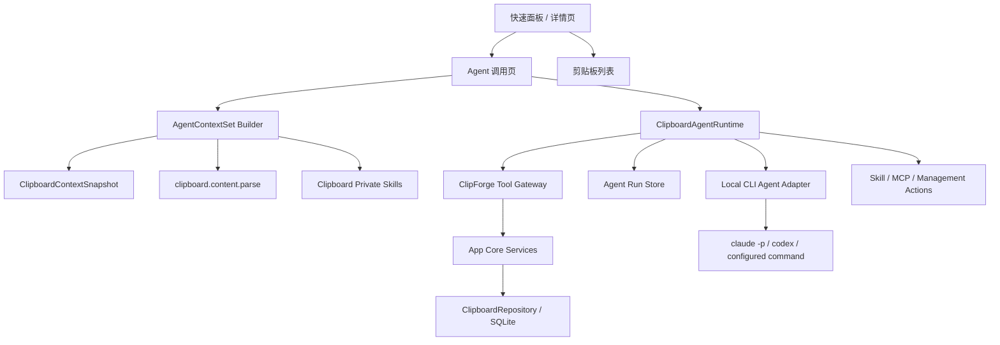
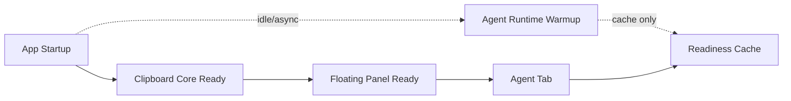
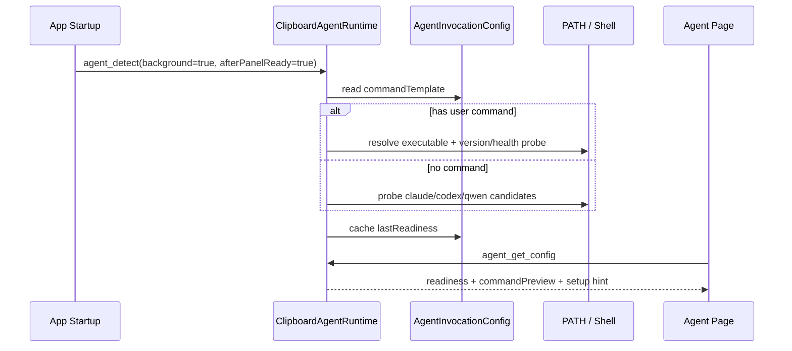
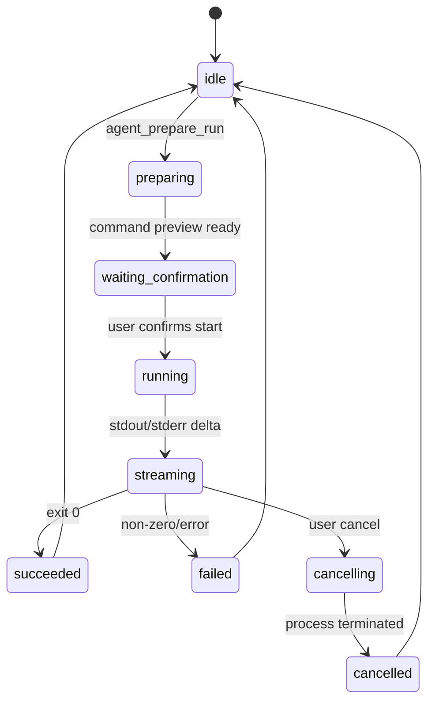

# 设计：剪贴板 Agent 调用面板

## 1. 核心判断

本提案只做“Agent 调用为剪贴板和 ClipForge 能力服务”，不做“Agent 管理”。产品结构上，Agent 是悬浮面板里的完整工作页；技术结构上，Agent 是 App Core 的一个受控调用方；权限结构上，Agent 只能通过上下文引用集合、上下文快照和明确工具接口读写数据。

UI 设计遵循工具型桌面应用原则：紧凑、低干扰、可键盘操作、状态明确。参考 `ui-ux-pro-max` 的交互建议，面板需要有清晰焦点态、加载态、取消态、错误态、可恢复状态，避免复杂 onboarding 和装饰性动效。

## 2. 架构



### 分层职责

- React UI：展示上下文引用篮、消息、run 状态、能力入口和结果动作，不直接管理子进程。
- ClipboardAgentRuntime：后台服务，保存会话、run 状态、输出流尾部、取消信号和错误诊断；不得成为悬浮面板显示链路的依赖。
- Local CLI Agent Adapter：负责命令检测、启动、stdin/stdout/stderr、退出码、取消和清理。
- ClipForge Tool Gateway：把 Agent 可用动作收敛到安全工具，不暴露数据库或 React state。
- App Core Services：唯一真实源，负责剪贴板读取、保存、复制、搜索、归档、收藏和 tag 更新。
- ClipForge Capability Surface：标准 skill、私域 skill、MCP tool、剪贴板管理动作和分析回填动作的统一入口。

## 3. 交互结构

### 快速面板

- 顶部保留剪贴板工具主导航，新增 `剪贴板` 和 `Agent` 两个一级页签。
- 默认仍打开 `剪贴板` 页，不能因为 Agent 功能改变主入口。
- 悬浮面板的唤起、定位、显示、隐藏、搜索和列表渲染不等待 Agent 服务初始化。
- 用户复制新内容并唤起面板时，`Agent` 页准备好默认上下文集合：当前 clip 作为第一条引用，但不自动发起请求。
- `Ctrl/Cmd+J` 仍交给动作解析器：链接默认 `builtin.open-link`，普通文本默认下钻详情页，其他内容由智能解析和插件候选处理；Agent 页不是 `Ctrl/Cmd+J` 的默认替代路径。

### Agent 页

- 顶部固定上下文引用篮，默认包含当前 clip；用户可切换为当前、指定条目、收藏、搜索结果、all、文件或 skill 上下文。
- 中间展示对话消息、工具调用、运行状态和错误。
- 底部是输入框，默认带上下文引用集合，不把完整正文直接插入输入框。
- 结果消息上提供动作：复制、保存为新条目、收藏来源、归档来源、追加 tag、重新运行、停止。
- 侧边或顶部紧凑区域提供能力入口：标准 skill、私域 skill、MCP tool、标签管理、收藏/归档、分析回填。
- 图标使用现有 lucide-react 图标，按钮需要有可访问标签和明确禁用态。

### Message Scroller 参考方案

Agent 页的消息区可以参考 shadcn `MessageScroller` 的行为模型，但样式要贴合 ClipForge 的紧凑悬浮面板，而不是做成完整聊天工作台。

布局结构：

```tsx
<AgentPanelShell>
  <AgentPanelHeader />
  <AgentContextReferenceBar />
  <MessageScrollerProvider
    autoScroll
    defaultScrollPosition="last-anchor"
    scrollPreviousItemPeek={48}
  >
    <MessageScroller className="agent-message-scroller">
      <MessageScrollerViewport aria-label="Agent messages">
        <MessageScrollerContent aria-busy={run.status === "streaming"}>
          {rows.map((row) => (
            <MessageScrollerItem
              key={row.id}
              messageId={row.id}
              scrollAnchor={row.kind === "user-message" || row.kind === "run-marker"}
            >
              <AgentMessageRow row={row} />
            </MessageScrollerItem>
          ))}
        </MessageScrollerContent>
      </MessageScrollerViewport>
      <MessageScrollerButton />
    </MessageScroller>
  </MessageScrollerProvider>
  <AgentComposer />
</AgentPanelShell>
```

滚动行为：

- 新用户消息或 run marker 作为 `scrollAnchor`，开始新一轮时靠近视口上方，并保留上一条内容的一小段上下文。
- 只有用户位于 live edge 时才跟随流式输出；用户滚轮、键盘滚动、选择文本、打开链接或跳转消息后，自动跟随立即暂停。
- 流式输出在用户阅读旧消息时继续写入后台，不改变当前视口；显示“有新回复 / 跳到最新”按钮。
- 加载更早消息或重新挂载会话时使用稳定 `messageId` 保持可见行，不用像素位置猜测。
- 重新打开隐藏后的 Agent 面板时默认定位到 `last-anchor`，即最近一次用户请求或 run marker，而不是绝对底部。
- 停止、重试、报错、工具调用展开/折叠不能让消息区跳动。

行类型：

| Row | 内容 | 是否可锚定 |
|-----|------|------------|
| `reference` | 剪贴板/文件/skill 上下文引用摘要 | 否 |
| `user-message` | 用户输入 | 是 |
| `assistant-message` | Agent 文本、Markdown、代码块 | 否 |
| `tool-call` | 工具调用预览、确认入口 | 可选 |
| `tool-result` | 工具结果摘要 | 否 |
| `run-marker` | run 开始、停止、重试、错误 | 是 |
| `result-actions` | 保存、复制、收藏、归档 | 否 |

视觉细节：

- 面板内部使用 4/8px spacing 节奏，消息行不做大气泡堆叠；系统、工具和结果动作更像列表行，用户/助手消息只做轻量分组。
- 引用篮固定在消息区上方，最大高度受限，长预览折叠；它是上下文，不是聊天消息气泡。
- Composer 固定在底部，最小高度稳定，发送、停止、附加全文授权、模型/provider 状态使用图标按钮加 tooltip。
- `MessageScrollerButton` 使用“跳到最新”图标按钮，只有离开 live edge 或有新内容时可交互。
- 错误和权限状态使用图标加文字，不依赖红/绿颜色本身表达含义。
- 新消息动画只使用 opacity/transform，禁用 height、margin、padding 动画；遵守 reduced motion。

可访问性：

- 消息视口是可聚焦 region，有明确 `aria-label`。
- transcript 内容用 log/live-region 语义，但流式 token 不逐字播报；run 结束、错误、需要确认等关键状态才通过 `aria-live` 通知。
- Icon-only 按钮必须有 `aria-label`，例如“停止运行”“允许本次使用全文”“保存为剪贴板条目”。
- 键盘路径：页签 -> 引用篮动作 -> 能力入口 -> 消息区 -> 跳到最新 -> composer -> 结果动作；不能出现 keyboard trap。

### 上下文引用篮

Agent 面板不是只能处理当前条目。当前 clip 只是默认上下文选择，用户可以在引用篮里组合多个来源：

| 来源 | 示例 | 默认权限 |
|------|------|----------|
| `current` | 当前刚复制的 clip | summary |
| `clip` | 指定一条历史记录 | summary |
| `selection` | 详情页选中的文本 / 代码块 | selected-content |
| `favorites` | 收藏条目集合 | summary |
| `search-result` | 当前搜索结果或筛选结果 | summary |
| `all` | 最近 N 条或用户显式选择的全量范围 | summary + 数量上限 |
| `file` | 用户添加的本地文件 | file metadata + explicit content |
| `skill-context` | 私域剪贴板 skill 生成的上下文 | skill-defined |

交互原则：

- 默认引用 `current`，但引用篮顶部要能一键切换为 `当前 / 收藏 / 搜索结果 / all`。
- 每个引用 chip 展示类型、标题、来源和权限范围，支持移除、展开预览、提升权限。
- `all` 必须有范围说明，例如“最近 20 条”“当前搜索结果 8 条”，不能无提示塞入全部历史。
- 文件引用必须由用户显式添加；仅展示文件名、大小、类型，读取正文需要单次授权。
- 引用篮变更只影响下一次发送，不自动重跑当前 run。
- 引用篮可以保存为私域 skill 的默认上下文模板，但保存和调用都必须由用户确认。

### 能力入口

Agent 面板同时是 ClipForge 自定义能力入口，但能力是 ClipForge 能力，不是 Agent 管理能力。

入口类型：

| 类型 | 示例 | 执行边界 |
|------|------|----------|
| 标准 skill | 摘要链接、整理标签、提取 JSON 字段、错误日志分析 | 用户选择后运行 |
| 私域 skill | 用户保存的剪贴板处理模板 | 手动运行，可编辑草稿 |
| MCP tool | `clipboard.search`、`clipboard.update`、外部 MCP 工具 | 工具权限裁剪 |
| 管理动作 | 批量打 tag、收藏、归档、保存为新条目 | 预览后确认 |
| 回填动作 | 分析结果保存、复制、粘贴、追加到原条目备注 | 显式结果动作 |

UI 要求：

- 能力入口默认折叠为一行工具栏或命令菜单，不压缩消息区和剪贴板列表。
- 常用入口使用 lucide 图标加 tooltip，例如 `Search`、`Tags`、`Archive`、`Save`、`Wrench`。
- 危险或批量动作必须展示预览：影响多少条、写入哪些 tag、保存到哪里。
- Agent 生成 skill 草稿后，只能展示为“保存为私域 skill”候选，不能自动启用。

### 详情页入口

- 详情页可提供“询问 Agent”动作，打开同一个 Agent 页并携带当前详情上下文。
- 编辑态中的 Agent 建议仍走 `detail-rich-editor-agent-bridge` 的 patch 预览和用户确认，不在本提案直接写 editor draft。

## 4. 数据模型

```ts
export type AgentContextReferenceSource =
  | "current"
  | "clip"
  | "selection"
  | "favorites"
  | "search-result"
  | "all"
  | "file"
  | "skill-context";

export type AgentContextReference = {
  id: string;
  source: AgentContextReferenceSource;
  clipId?: string;
  filePath?: string;
  skillId?: string;
  title: string;
  summary: string;
  payloadKind: string;
  primaryUrl?: string;
  textPreview: string;
  tags: string[];
  sourceApp?: {
    name: string;
    bundleId?: string;
  };
  parsedTargets: SmartParsedTarget[];
  permissionScope: "summary" | "current-content" | "selected-content";
  itemCount?: number;
  scopeLabel?: string;
  tokenEstimate?: number;
};

export type AgentContextSet = {
  id: string;
  mode: "current" | "manual" | "favorites" | "search-result" | "all" | "skill";
  references: AgentContextReference[];
  createdAt: number;
  updatedAt: number;
  limits: {
    maxItems: number;
    maxCharsPerItem: number;
    maxTotalChars: number;
  };
};

export type AgentConversation = {
  id: string;
  createdAt: number;
  updatedAt: number;
  title: string;
  contextSetId?: string;
  adapterId: string;
};

export type AgentMessage = {
  id: string;
  conversationId: string;
  role: "user" | "assistant" | "tool" | "system";
  content: string;
  createdAt: number;
  provenance?: {
    clipId?: string;
    agentRunId?: string;
    generatedBy: "user" | "agent" | "tool" | "system";
  };
};

export type AgentRun = {
  id: string;
  conversationId: string;
  adapterId: string;
  status: "queued" | "running" | "succeeded" | "failed" | "cancelled";
  startedAt: number;
  endedAt?: number;
  exitCode?: number;
  errorMessage?: string;
};
```

`AgentContextSet` 是 prompt 输入的唯一默认上下文容器。当前 clip 只是默认第一项引用。完整正文、图片 OCR、HTML、文件列表或来源应用可执行路径必须由权限策略单独开启。

## 5. 标准协议兼容

根据 Context7 拉取的 AI SDK v5 文档，当前推荐形态是：

- Core 调用使用 `generateText` / `streamText` 这类统一 provider API。
- OpenAI provider 可通过 `createOpenAI({ apiKey, baseURL })` 接入 OpenAI-compatible 服务。
- 多 provider 可通过 provider registry 统一注册。
- UI 层可消费 `UIMessage` stream；文本、tool call、tool result 和自定义 data part 都能走同一条消息流。

ClipForge 的前端 Agent 页应该优先兼容这套抽象，而不是绑定 `claude -p` 或任何单一 CLI。

```ts
export type ClipboardAgentProviderKind =
  | "ai-sdk"
  | "openai-compatible"
  | "local-cli";

export type ClipboardAgentProviderConfig = {
  id: string;
  kind: ClipboardAgentProviderKind;
  displayName: string;
  enabled: boolean;
  modelId?: string;
  baseURL?: string;
  apiKeyRef?: string;
  commandTemplate?: string;
  commandArgs?: string[];
  defaultOptions?: {
    temperature?: number;
    maxOutputTokens?: number;
    reasoningEffort?: "low" | "medium" | "high";
  };
};
```

前端消息结构采用 UIMessage 风格的 parts 模型：

```ts
export type ClipboardAgentMessagePart =
  | { type: "text"; text: string }
  | { type: "tool-call"; toolCallId: string; toolName: string; args: unknown }
  | { type: "tool-result"; toolCallId: string; toolName: string; result: unknown; isError?: boolean }
  | { type: "data-context-reference"; data: AgentContextReference }
  | { type: "data-context-set"; data: AgentContextSet }
  | { type: "data-status"; data: { status: AgentRun["status"]; message?: string } }
  | { type: "data-result-actions"; data: AgentResultAction[] };

export type ClipboardAgentUiMessage = {
  id: string;
  role: "system" | "user" | "assistant" | "tool";
  parts: ClipboardAgentMessagePart[];
  metadata?: {
    conversationId: string;
    runId?: string;
    createdAt: number;
  };
};
```

消息渲染前应转成 `AgentTranscriptRow`，让滚动器只关心稳定行 id、锚点和行高，不关心 provider 细节：

```ts
export type AgentTranscriptRow = {
  id: string;
  messageId?: string;
  runId?: string;
  kind:
    | "reference"
    | "user-message"
    | "assistant-message"
    | "tool-call"
    | "tool-result"
    | "run-marker"
    | "result-actions";
  scrollAnchor: boolean;
  createdAt: number;
  parts: ClipboardAgentMessagePart[];
};
```

服务层内部可以做不同 provider 的映射：

- `ai-sdk`：直接走 AI SDK provider registry 和 `streamText`。
- `openai-compatible`：用 OpenAI-compatible 配置生成 provider，支持用户自己的 `baseURL/apiKey/modelId`。
- `local-cli`：把 CLI stdout/stderr 归一化成 `text` part，把结构化工具调用归一化成 `tool-call/tool-result` part。

前端只消费 `ClipboardAgentUiMessage` 和标准 run event，不关心具体 provider。API key 和 provider secret 只保存在原生层或安全配置层，不能下发给 React。

工具调用也要保持双向兼容：

```ts
export type ClipboardAgentToolDescriptor = {
  name: string;
  description: string;
  inputSchema: unknown; // JSON Schema; 实现层可由 Zod 转换
  requiresConfirmation: boolean;
  mcpToolName?: string;
};
```

这让同一套 ClipForge 工具既能映射为 AI SDK tool，也能映射为 MCP tool。`clipboard.context.get`、`clipboard.content.parse`、`clipboard.copy` 等工具只维护一份权限策略。

## 6. 本地 CLI Agent Adapter

AionUi 的顺滑体验主要来自四个细节：

1. 启动后预取 `/api/agents`，把检测结果放到共享 SWR cache，页面首次渲染就能知道哪些 Agent 可用、有哪些模型/模式。
2. 后端返回统一 `AgentMetadata`，其中 `available` 表示启动时已经能从 `PATH` 解析命令；`handshake` 保存最近一次 init 得到的模型、模式、命令能力。
3. 发送前可以调用 `checkAgentHealth` 做当前 Agent 健康检查；失败时再顺序检查其他候选，并尽早返回第一个可用 Agent。
4. 创建会话和真正发送消息解耦：先创建 conversation，初始消息临时保存，进入对话页后由运行时 gate 发送，避免页面跳转、会话初始化和消息发送互相阻塞。

ClipForge 不需要完整复刻这套 Agent catalog。可借鉴的是“探测结果缓存 + 发送前健康检查 + run 状态机 + 进程清理”，并把它压缩为单一 Agent 调用服务。

```ts
export type AgentReadiness = {
  ready: boolean;
  reason?:
    | "not-configured"
    | "not-found"
    | "permission-denied"
    | "version-unsupported"
    | "auth-required"
    | "health-timeout";
  commandPreview?: string;
  resolvedPath?: string;
  checkedAt: number;
  latencyMs?: number;
};

export type ClipboardAgentRunInput = {
  conversationId: string;
  message: string;
  contextSet: AgentContextSet;
  tools: ClipboardAgentToolDescriptor[];
  permissionScope: AgentContextReference["permissionScope"];
};

export type ClipboardAgentEvent =
  | { type: "message_delta"; runId: string; delta: string }
  | { type: "tool_call"; runId: string; toolName: string; toolCallId: string; preview: string }
  | { type: "tool_result"; runId: string; toolCallId: string; ok: boolean; summary: string }
  | { type: "status"; runId: string; status: AgentRun["status"] }
  | { type: "error"; runId: string; message: string };

export type ClipboardAgentAdapter = {
  id: string;
  displayName: string;
  kind: "local-cli";
  detect(): Promise<AgentReadiness>;
  startRun(input: ClipboardAgentRunInput): AsyncIterable<ClipboardAgentEvent>;
  cancel(runId: string): Promise<void>;
};
```

第一阶段只需要一个 adapter 槽位，不需要 Agent 管理列表：

- 优先读取用户确认过的命令模板，例如 `claude -p {{prompt}}`。
- 没有模板时，按 `claude`、`codex`、`qwen` 等少量候选做静默检测，只返回“可用建议”，不展示 Agent 管理中心。
- 检测只判断命令可执行、版本可读、基础健康检查可完成；不尝试登录、不代替用户配置 API key。
- 命令预览必须可见，首次执行需要确认。
- 子进程状态写入本地 run store，应用退出时清理未结束进程。

AionUi 的 `agent-process-registry` 思路可用于登记 `pid`、`process_group_id`、`conversation_id`、`agent_type`、`command_preview` 和 `registered_at_ms`，退出时先 `SIGTERM`，超时后 `SIGKILL`；Windows 走 `taskkill /T`。ClipForge 只保留这类运行时卫生能力，不引入 AionUi 的 Agent 编排层。

## 7. 启动隔离策略

Agent 能力可以作为应用启动后的后台服务，但必须和悬浮面板主链路隔离。



启动顺序：

1. 先完成剪贴板监听、快捷键、悬浮面板窗口和基础数据读取。
2. 悬浮面板标记 ready 后，再用 idle/background 任务启动 Agent 探测。
3. Agent 探测只写 readiness cache 和日志，不触发面板重排、不抢焦点、不打开终端。
4. 如果 Agent 探测超过时间预算，直接降级为 `health-timeout`，等待用户进入 Agent 页时再刷新。

硬约束：

- `show_panel`、`hide_panel`、`position_panel_window_fast`、剪贴板 capture、搜索和复制回写不能 await Agent command。
- Agent service 初始化失败不能导致 React 根组件不渲染，不能导致悬浮面板空白。
- Agent 页签可以显示“检测中 / 未配置 / 可用”，但剪贴板页完全不展示 Agent 错误。
- 后台探测必须可取消；应用退出或重启时清理正在探测或运行的子进程。
- Agent 输出事件和面板基础事件分通道，避免大输出阻塞面板可见性、焦点恢复或列表刷新。

建议时间预算：

| 阶段 | 预算 | 超时行为 |
|------|------|----------|
| 启动后后台 detect | 1500ms | 标记 `health-timeout`，不重试直到用户进入 Agent 页 |
| 进入 Agent 页刷新 readiness | 3000ms | 展示重试按钮 |
| `agent_prepare_run` | 1000ms | 保留输入，不启动 run |
| 首次 `agent_start_run` 命令启动 | 5000ms | 展示启动失败，可复制命令预览 |

## 8. 具体代码方案

### Rust command

Agent 调用属于原生能力，应落在 Rust/Tauri command 或 sidecar service，不放在 React 组件里。

```ts
type AgentInvocationConfig = {
  enabled: boolean;
  activeAdapterId?: string;
  provider?: ClipboardAgentProviderConfig;
  commandTemplate?: string;
  commandArgs?: string[];
  env?: Record<string, string>;
  firstRunConfirmedAt?: number;
  lastReadiness?: AgentReadiness;
};

type AgentDetectCandidate = {
  adapterId: string;
  displayName: string;
  command: string;
  defaultArgs: string[];
  priority: number;
};
```

建议 command 面：

| Command | 作用 |
|---------|------|
| `agent_get_config` | 读取当前单一 Agent 调用配置和最近检测结果 |
| `agent_list_providers` | 返回可用 provider 摘要，不包含 secret |
| `agent_check_provider` | 检查 AI SDK/OpenAI-compatible provider 连通性 |
| `agent_detect` | 后台检测配置命令和少量候选 CLI，返回 readiness |
| `agent_prepare_run` | 构造 prompt、命令预览和权限裁剪摘要，不启动进程 |
| `agent_start_run` | 用户确认后启动 run，返回 `runId` |
| `agent_cancel_run` | 取消 run 并清理进程树 |
| `agent_get_run` | 读取 run 状态、消息尾部和错误 |
| `agent_get_transcript` | 读取会话消息并返回 `AgentTranscriptRow[]` |
| `agent_list_recent_conversations` | 读取最近最小会话，不做完整 Agent 管理 |

Tauri event 面：

```ts
type ClipboardAgentRuntimeEvent =
  | { type: "agent_run_started"; runId: string; conversationId: string }
  | { type: "agent_message_delta"; runId: string; delta: string }
  | { type: "agent_ui_message"; runId: string; message: ClipboardAgentUiMessage }
  | { type: "agent_transcript_rows"; runId: string; rows: AgentTranscriptRow[] }
  | { type: "agent_tool_preview"; runId: string; toolCallId: string; toolName: string; preview: string }
  | { type: "agent_tool_result"; runId: string; toolCallId: string; ok: boolean; summary: string }
  | { type: "agent_run_finished"; runId: string; status: AgentRun["status"]; exitCode?: number }
  | { type: "agent_run_error"; runId: string; errorCode: string; message: string };
```

### 检测流程



检测原则：

- 冷启动只做轻量检查，避免阻塞剪贴板监听和快速面板。
- 冷启动阶段不能被 React app bootstrap await；最多通过 fire-and-forget 或 Rust 后台 task 写入 readiness cache。
- macOS GUI app 的 `PATH` 经常不完整，Rust 侧需要合并常见 shell 路径，例如 `/opt/homebrew/bin`、`/usr/local/bin`、`~/.local/bin`、`~/.cargo/bin`。
- 每次用户进入 Agent 页时复用最近检测结果；超过 TTL 或用户点击刷新才重新检测。
- 发送前做一次快速健康检查，失败时展示“命令不存在 / 权限不足 / 需要登录 / 超时”这类明确原因。

### 运行状态机



运行约束：

- `preparing` 阶段只生成 `AgentContextSet`、prompt 和命令预览，不启动 CLI。
- `running/streaming` 阶段由 Rust 持有进程、输出 buffer 和状态，React 隐藏不影响 run。
- 同一条 clip 默认只允许一个前台 run；后续可以支持队列，但第一阶段不做并发。
- stdout/stderr 需要限流合并后发给前端，避免大输出拖慢 WebView。

### Prompt 构造

默认 prompt 由结构化上下文引用集合和用户输入组成：

```text
你正在为 ClipForge 剪贴板工具处理当前复制内容。

<clipforge_context_set>
模式: {{mode}}
引用数量: {{references.length}}
范围: {{scopeLabel}}

{{#each references}}
<reference>
来源: {{source}}
标题: {{title}}
类型: {{payloadKind}}
来源应用: {{sourceApp.name}}
URL: {{primaryUrl}}
摘要: {{summary}}
预览: {{textPreview}}
智能候选: {{parsedTargets}}
权限范围: {{permissionScope}}
</reference>
{{/each}}
</clipforge_context_set>

用户请求:
{{message}}
```

完整正文不默认进入 prompt。用户点击“允许使用全文”后，本次 run 中对应引用的 `permissionScope` 才能从 `summary` 升级为 `current-content`。

## 9. 面板隐藏与后台运行

- Agent run 不绑定 React 组件生命周期。
- 隐藏快速面板不会取消 run。
- 重新打开面板时，从 `AgentRunStore` 恢复会话、消息、状态和最后输出片段。
- 用户点击停止时才取消当前 run。
- 应用退出时清理仍在运行的本地子进程，并记录取消原因。
- 长任务期间不阻塞剪贴板监听、搜索索引、复制回写或快速面板列表渲染。
- Agent run 输出过大时只保留尾部 buffer，完整日志落后台，不向前端连续推送大块文本。
- 消息滚动状态属于 UI 层本地状态，只保存 `conversationId/currentAnchorId/liveEdgeFollowing` 这类恢复信息，不写入 Agent provider 配置。

## 10. Agent 可用工具

第一阶段暴露受限工具面：

| 工具 | 用途 | 写入限制 |
|------|------|----------|
| `clipboard.context.get` | 获取当前引用摘要和授权字段 | 只读 |
| `clipboard.context.compose` | 按 current/clip/favorites/search/all/file/skill 组合上下文引用集合 | 只读 |
| `clipboard.content.parse` | 获取 `SmartParsedTarget` 候选 | 只读 |
| `clipboard.capture` | 显式采集当前系统剪贴板 | 需要用户触发或确认 |
| `clipboard.update` | 保存 Agent 结果为新条目或更新 tag | 需要预览或结果动作 |
| `clipboard.copy` | 把可见结果写回系统剪贴板 | 需要用户点击 |
| `clipboard.search` | 搜索历史摘要 | 默认返回摘要，不返回全文 |
| `clipboard.skill.list` | 列出用户私域剪贴板 skill | 只读 |
| `clipboard.skill.save_draft` | 保存 skill 草稿 | 需要用户确认 |
| `clipboard.skill.run` | 用当前引用集合运行 skill | 需要用户触发 |

所有工具返回值都必须包含 `traceId`、权限裁剪信息和错误摘要。日志只记录长度、类型、id、状态和裁剪字段，不记录完整正文。

## 11. 私域剪贴板 Skill

私域 skill 是用户为自己的剪贴板处理工作流沉淀的轻量能力，不是插件市场，也不是 Agent 自动学习。

```ts
export type ClipboardPrivateSkill = {
  id: string;
  name: string;
  description?: string;
  icon?: { type: "lucide"; value: string };
  promptTemplate: string;
  defaultContextMode: AgentContextSet["mode"];
  allowedReferenceSources: AgentContextReferenceSource[];
  requiredTools: string[];
  outputActions: AgentResultAction["type"][];
  createdAt: number;
  updatedAt: number;
};
```

使用边界：

- Agent 可以根据对话建议 skill 草稿，但保存前必须展示名称、说明、上下文来源、工具权限和输出动作。
- Skill 默认只读剪贴板引用集合；需要写入剪贴板、复制到系统剪贴板、收藏、归档时都必须走显式结果动作。
- Skill 可以通过 MCP 暴露为 `clipboard.skill.run`，但 MCP 调用也必须携带上下文范围和权限裁剪结果。
- Skill 不自动改触发优先级，不后台自学习，不自行采集全部历史。

## 12. 结果动作

Agent 输出不会自动改变剪贴板。UI 明确提供以下动作：

- `copyResult`：复制当前结果到系统剪贴板。
- `saveAsClip`：保存当前结果为新剪贴板条目，默认追加 `AI` tag。
- `favoriteSourceClip`：收藏来源条目。
- `archiveSourceClip`：归档来源条目。
- `appendTag`：给来源条目追加 tag，例如 `AI`、`分析`、`待处理`。
- `pasteResult`：后续接现有粘贴链路，必须沿用权限和焦点恢复策略。

保存结果时写入 provenance：

```ts
export type AgentGeneratedProvenance = {
  generatedBy: "agent";
  sourceClipId: string;
  conversationId: string;
  runId: string;
  adapterId: string;
  createdAt: number;
  defaultTags: ["AI"];
};
```

## 13. 安全边界

- 默认只发送摘要、URL、类型、来源应用名称和短预览。
- 完整正文需要用户对具体引用或引用集合在当前 run 里显式授权。
- `all`、收藏集合、搜索结果集合必须有 item 数量和字符上限，默认只传摘要。
- 图片、文件、HTML/RTF 只传引用和摘要，原始二进制不默认进入 Agent。
- 本地 CLI 命令模板必须显示预览，首次执行需确认。
- OpenAI-compatible 的 `apiKey/baseURL` 只保存在原生安全配置层，React 只能看到脱敏 provider 摘要。
- Agent 工具调用若会写入历史、系统剪贴板或 tag，需要在 UI 中呈现为可确认动作。
- Agent 不能创建、更新、排序或自动执行插件；插件固化属于独立提案的后续能力，第一阶段不做。
- CLI 缺失或异常退出时，提示恢复路径，不影响剪贴板工具主功能。

## 14. 开放问题

- 第一阶段默认 adapter 是否只支持单个命令模板，还是检测 `claude`、`codex`、`qwen` 后展示一个极简选择器。
- Agent 对话是否写入 SQLite，还是先写入轻量本地 JSON store，等剪贴板 SQLite 模型稳定后再迁移。
- `pasteResult` 是否进入本提案第一版，还是等粘贴焦点恢复链路完全稳定后再启用。
- 对 URL 文章分析是否内置网页抓取，还是完全交给 Agent 自己通过 MCP/browser 能力处理。
- AI SDK 运行时是否放在前端同进程、Rust sidecar Node worker，还是先通过 OpenAI-compatible HTTP client 在 Rust 侧直连实现。
