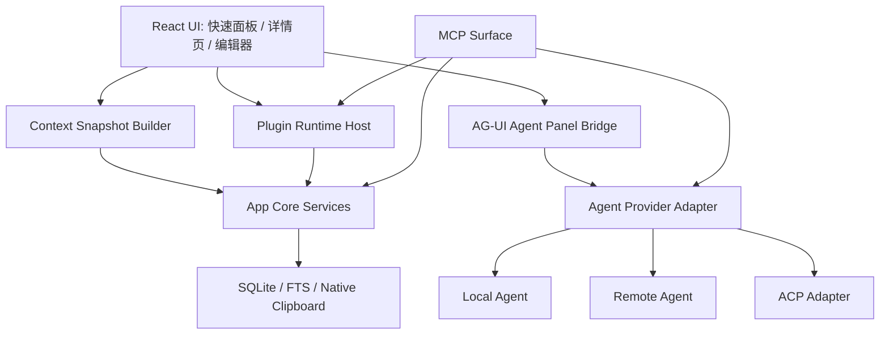

# 设计：上下文驱动的插件与 Agent 运行时边界

## 1. 分层架构



### App Core Services

App Core 是唯一业务真实源，负责：

- 剪贴板采集、搜索、复制、更新、删除。
- 详情页上下文构建。
- 编辑器 session 管理。
- 内容分析、OCR、模板渲染等内置能力。

插件、Agent、MCP 都不能绕过 App Core 直接读写数据库或 UI state。

### Plugin Runtime Host

插件是能力单元，不等于 MCP server。插件可以有不同运行形态：

- `builtin`：内置插件，例如 Markdown 检查、模板变量渲染。
- `script`：用户或 Agent 生成的本地快捷指令脚本，使用受控变量、权限和确认流程执行。
- `mcp`：外部 MCP server 暴露的工具。
- `rpc`：本地 sidecar 或远程服务。
- `panel`：只返回声明式渲染 schema，由详情页沙盒渲染。

### MCP Surface

MCP 是对外稳定工具面：

- 用于外部 Agent/客户端调用 ClipForge 能力。
- 用于把插件能力以工具形式暴露给外部。
- 不直接操作 React 组件、Tiptap editor instance 或临时 UI state。

### AG-UI Agent Panel Bridge

AG-UI 是 Agent 与页面之间的事件协议：

- 接收 run input：messages、tools、context、state。
- 渲染 run lifecycle、message、tool call、tool result、state delta、error event。
- 允许应用自定义 `CUSTOM` event，用于详情页沙盒面板、patch preview、变量展示。

AG-UI 不承担插件发现、权限授权或升级管理。

## 2. Context Snapshot Contract

第一版 snapshot 同时覆盖详情页只读上下文和编辑态上下文，但分层启用。

```ts
export type ClipboardContextSnapshot = {
  schemaVersion: 1;
  snapshotId: string;
  createdAt: number;
  clip: {
    id: string;
    contentKind: string;
    payloadKind: string;
    title: string;
    summary: string;
    tags: string[];
    chars: number;
    lines: number;
    createdAt: number;
    updatedAt: number;
    lastSeenAt: number;
    lastCopiedAt?: number;
  };
  sourceApp?: {
    name: string;
    bundleId?: string;
    iconAvailable: boolean;
    executablePath?: string;
  };
  activeApp?: {
    name: string;
    bundleId?: string;
    iconAvailable: boolean;
    executablePath?: string;
  };
  provenance?: {
    generatedBy?: "user" | "agent" | "plugin" | "system";
    agentProviderId?: string;
    agentRunId?: string;
    agentGenerated: boolean;
    defaultTags: string[];
  };
  detail: {
    routePath: "/clip/$clipId";
    renderer: string;
    detailMode: string;
    businessChain: string;
  };
  trigger: {
    surface: "quick-panel" | "detail" | "editor" | "plugin" | "mcp" | "agent-panel";
    action: string;
    userInitiated: boolean;
  };
  editor?: EditorSessionSnapshot;
  permissions: ContextPermissionSnapshot;
  diagnostics: {
    source: "live" | "cached" | "partial";
    missing: string[];
    redacted: string[];
  };
};
```

### Editor Session Snapshot

```ts
export type EditorSessionSnapshot = {
  sessionId: string;
  draftVersion: number;
  mode: "readonly" | "editing";
  dirty: boolean;
  contentFormat: "text" | "markdown" | "html" | "json";
  selectionText?: string;
  readableFields: Array<"text" | "html" | "json" | "selection">;
};
```

详情页打开时默认没有 `editor`。用户点击“编辑”后才创建 session。

## 3. 当前上下文确定性

### 确定可用

- 内容正文、时间、收藏、标签、复制次数。
- `payloadKind` 和 `kind` 的基础推断。
- 标题、摘要、URL、host、Markdown 标记。
- macOS 下的来源应用名称、bundle id、可执行路径和 icon。
- 详情页渲染器、业务链路、路由、内容长度、行数。

### 条件可用

- 图片、文件、HTML 当前主要来自文本推断，不是稳定多 MIME 采集。
- 当前键入环境存在于粘贴目标恢复链路和日志中，但还不是稳定 context API。
- 前端和后端都有内容分析逻辑，需要后续统一。

### 第一阶段必须修正

- 后台监听和显式 capture 的 `kind` 分类路径要统一。
- `sourceApp.executablePath` 默认只允许本地 trusted 插件读取。
- 大正文、OCR 文本、编辑器全文必须按权限和长度上限暴露。
- Agent 生成或 Agent 建议应用保存后的条目必须标记来源，并默认追加 `AI` tag。

## 4. 插件边界

```ts
export type ClipForgePluginManifest = {
  id: string;
  name: string;
  icon: {
    type: "lucide" | "image";
    value: string;
  };
  description?: string;
  version: string;
  runtime: "builtin" | "script" | "mcp" | "rpc" | "panel";
  entry?: string;
  capabilities: Array<
    | "context.read"
    | "content.read"
    | "content.transform"
    | "editor.previewPatch"
    | "editor.applyPatch"
    | "editor.suggestUpdate"
    | "metadata.updateTags"
    | "clipboard.write"
    | "external.openUrl"
    | "external.openApp"
    | "external.openTerminal"
    | "external.runCommand"
    | "agent.call"
    | "panel.render"
    | "network.request"
  >;
  contextFields: string[];
  contentTypes: string[];
  triggers: Array<{
    surface: "detail" | "editor" | "quick-action" | "background";
    actionId: string;
    label: string;
    shortcut?: string;
  }>;
  matching: {
    priority: number;
    contentKinds?: string[];
    payloadKinds?: string[];
    sourceAppBundleIds?: string[];
    activeAppBundleIds?: string[];
    urlPatterns?: string[];
    tagFilters?: string[];
  };
  permissions: {
    requiresUserConfirmation: boolean;
    allowFullContent: boolean;
    allowSourceExecutablePath: boolean;
    allowNetwork: boolean;
    allowOpenUrl: boolean;
    allowOpenApp: boolean;
    allowRunCommand: boolean;
    commandAllowlist?: string[];
  };
  compatibility: {
    app: string;
    contextSchema: number;
    agui?: string;
    mcp?: string;
  };
};
```

### 标准内置插件：打开链接

现有详情页“打开链接”能力应改造成内置插件，而不是保留 UI 特判：

```ts
const openLinkPlugin: ClipForgePluginManifest = {
  id: "builtin.open-link",
  name: "打开链接",
  icon: { type: "lucide", value: "ExternalLink" },
  version: "1.0.0",
  runtime: "builtin",
  capabilities: ["context.read", "external.openUrl"],
  contextFields: ["clip.url", "clip.content", "clip.payloadKind"],
  contentTypes: ["link", "text", "markdown", "html"],
  triggers: [
    { surface: "detail", actionId: "open-link", label: "打开链接", shortcut: "Mod+J" },
    { surface: "quick-action", actionId: "open-link", label: "打开链接", shortcut: "Mod+J" }
  ],
  matching: {
    priority: 900,
    contentKinds: ["link"],
    payloadKinds: ["link", "html", "markdown", "text"],
    urlPatterns: ["^https?://"]
  },
  permissions: {
    requiresUserConfirmation: false,
    allowFullContent: false,
    allowSourceExecutablePath: false,
    allowNetwork: false,
    allowOpenUrl: true,
    allowOpenApp: false,
    allowRunCommand: false
  },
  compatibility: { app: ">=0.1.0", contextSchema: 1 }
};
```

执行规则：

- 插件从 `clip.url` 或内容中的第一个安全 URL 解析目标。
- 只允许 `http:` / `https:`，其它 scheme 第一阶段必须二次确认或禁用。
- 执行使用现有 `openUrl` 能力，但调用链改为 `clipboard.plugin.call({ pluginId: "builtin.open-link" })`。
- 结构化日志记录 `pluginId`、`actionId`、`targetHost`、`permissionDecision`，不记录完整 URL query。

### 标准内置插件：进入详情

普通文本没有更高优先级插件命中时，`Ctrl/Cmd+J` 默认进入详情页：

```ts
const openDetailPlugin: ClipForgePluginManifest = {
  id: "builtin.open-detail",
  name: "进入详情",
  icon: { type: "lucide", value: "FileJson" },
  version: "1.0.0",
  runtime: "builtin",
  capabilities: ["context.read", "ui.navigateDetail"],
  contextFields: ["clip.id", "clip.payloadKind", "clip.contentKind"],
  contentTypes: ["text", "markdown", "code", "command", "attachment"],
  triggers: [
    { surface: "quick-action", actionId: "open-detail", label: "进入详情", shortcut: "Mod+J" },
    { surface: "detail", actionId: "open-detail", label: "进入详情" }
  ],
  matching: {
    priority: 100,
    contentKinds: ["text", "markdown", "code", "command", "attachment"]
  },
  permissions: {
    requiresUserConfirmation: false,
    allowFullContent: false,
    allowSourceExecutablePath: false,
    allowNetwork: false,
    allowOpenUrl: false,
    allowOpenApp: false,
    allowRunCommand: false
  },
  compatibility: { app: ">=0.1.0", contextSchema: 1 }
};
```

### `Ctrl/Cmd+J` 动作解析器

`Ctrl/Cmd+J` 是快速动作入口，不再直接绑定“打开链接”或“进入详情”。解析流程：

1. 构造 `ClipboardContextSnapshot`，包含当前 clip、复制来源应用 `sourceApp`、当前前台应用 `activeApp`、触发面和快捷键。
2. 读取所有启用插件 manifest，过滤 `surface=quick-action/detail` 且 content type 匹配的插件。
3. 调用智能内容解析器，提取可复制、可打开、可下钻的候选片段。
4. 按 `matching.priority`、source app、active app、tag、URL pattern 和解析候选计算候选 action。
5. 如果最高候选是 `builtin.open-link`，直接打开安全链接。
6. 如果无其它高优先级候选且内容是普通文本，执行 `builtin.open-detail`。
7. 如果最高候选需要权限确认（如 `runCommand/openApp`），先展示动作预览。
8. 如果多个候选分数接近，展示紧凑动作菜单；第一阶段只记录日志，不做学习。

解析结果：

```ts
export type PluginActionResolution = {
  traceId: string;
  clipId: string;
  surface: "quick-action" | "detail" | "editor";
  shortcut?: "Mod+J";
  selected: {
    pluginId: string;
    actionId: string;
    priority: number;
    requiresUserConfirmation: boolean;
    targetCandidateId?: string;
  };
  parsedTargets: SmartParsedTarget[];
  candidates: Array<{
    pluginId: string;
    actionId: string;
    score: number;
    reasons: string[];
  }>;
};
```

### 智能内容解析

智能内容解析只面向“当前内容”，不做长期学习、不自动调整插件优先级。它的目标是预测用户现在最可能想复制、打开或下钻的片段。

```ts
export type SmartParsedTarget = {
  id: string;
  kind:
    | "url"
    | "filePath"
    | "command"
    | "jsonField"
    | "codeBlock"
    | "markdownHeading"
    | "markdownLink"
    | "errorBlock"
    | "plainSummary";
  label: string;
  value: string;
  range?: { start: number; end: number };
  suggestedActions: Array<"copy" | "open" | "openDetail" | "runPlugin">;
  confidence: "high" | "medium" | "low";
  reasons: string[];
};
```

规则：

- 解析器第一阶段采用确定性规则：URL、文件路径、shell 命令、JSON path、Markdown 链接/标题、代码块、常见错误块。
- 解析结果只作为 action 候选输入，不直接执行。
- Agent 可以通过 MCP 请求解析结果，并基于结果生成插件草稿或建议用户复制某个字段。
- 不保存跨会话学习权重，不根据用户选择自动改插件优先级。
- 快速面板热路径只运行轻量同步解析；长文本解析需要有长度上限和超时。

### 受控脚本插件

脚本插件是详情页快捷指令，不是任意代码扩展。它由 manifest、变量模板和执行策略组成：

```ts
export type ScriptPluginSpec = {
  pluginId: string;
  shell: "system" | "zsh" | "bash" | "powershell";
  mode: "open-terminal" | "run-background" | "copy-command";
  cwd?: string;
  commandTemplate: string;
  env?: Record<string, string>;
  timeoutMs: number;
  outputMode: "panel" | "toast" | "log-only";
};
```

示例：基于当前详情内容打开终端并执行 Claude Code 非交互命令：

```json
{
  "pluginId": "user.claude-p-current-clip",
  "shell": "zsh",
  "mode": "open-terminal",
  "cwd": "{{runtime.homeDir}}",
  "commandTemplate": "claude -p {{json editor.text}}",
  "timeoutMs": 120000,
  "outputMode": "panel"
}
```

`claude -p` 是 Claude Code 的 print / non-interactive 模式；长输出场景可以使用 `--output-format=stream-json` 作为后续增强。

安全规则：

- `commandTemplate` 只能通过变量渲染器生成 argv 或 shell-escaped 字符串，禁止字符串拼接未转义变量。
- `mode=open-terminal` 默认比后台执行更安全，因为用户能看到命令窗口；`run-background` 必须单独授权。
- `allowRunCommand=true` 的插件必须显示将执行的命令预览。
- Agent 通过 MCP 生成脚本插件时只能保存为 `draft`，第一次执行必须用户确认。
- `commandAllowlist` 第一阶段至少限制命令前缀，例如 `claude`、`open`、`code`；权限扩大必须重新确认。

插件输出不能直接执行 UI 代码。第一阶段只允许以下输出：

- `renderPanel`：声明式面板 schema。
- `previewPatch`：编辑器 patch 预览。
- `replaceSelection`：编辑器选区替换建议。
- `replaceDocument`：整篇内容替换建议。
- `suggestUpdate`：Agent 返回智能建议反吐，包含内容 patch、tag patch、说明和风险级别。
- `updateTags`：tag patch 预览，只能在用户确认后应用。
- `copyResult`：把结果写到系统剪贴板，需要用户确认。
- `openUrl`：打开 URL，第一阶段由 `builtin.open-link` 使用。
- `openApp`：打开本地应用，需要用户确认。
- `runCommand`：执行受控脚本插件，需要命令预览、权限和日志。
- `callAgent`：调用 Agent Provider，需要用户确认和日志。

## 5. Agent 边界

Agent 是协作者，不是插件本身。第一阶段定义统一 provider：

```ts
export type AgentProvider = {
  id: string;
  kind: "local" | "remote" | "acp";
  displayName: string;
  startRun(input: AgentRunInput): AsyncIterable<AgUiEvent>;
  cancelRun(runId: string): Promise<void>;
};
```

Agent 输入只能由 `ClipboardContextSnapshot`、用户明确输入、以及当前会话允许的 tools 组成。

Agent 输出统一转成 AG-UI events：

- run started / finished
- text message delta
- tool call start / args / end
- tool result
- state snapshot / delta
- error event
- custom event：panel render、patch preview、permission prompt
- custom event：suggest update、tag patch preview、agent generated clip metadata

### Agent 生成内容的来源规则

Agent 生成的新粘贴项或 Agent 建议应用保存后的条目必须携带来源元数据：

```ts
type AgentGeneratedClipMetadata = {
  agentGenerated: true;
  agentProviderId: string;
  agentRunId: string;
  suggestionId?: string;
  appliedAt: number;
  defaultTags: ["AI"];
};
```

规则：

- 默认追加 `AI` tag。
- 用户手动移除 `AI` tag 后，普通编辑保存不再自动加回。
- 如果同一条目再次由 Agent 生成、Agent 改写或 Agent 建议应用保存，可以再次追加 `AI` tag。
- MCP、插件、Agent 日志只记录 `agentProviderId`、`agentRunId`、tag 数量和字段长度，不记录完整正文。

## 6. MCP 工具面

第一阶段建议新增工具名：

| 工具 | 说明 |
|------|------|
| `clipboard.context.get` | 获取当前详情页或编辑会话的脱敏上下文 |
| `clipboard.content.parse` | 对当前 clip 或指定文本做智能内容解析，返回可复制/可打开/可下钻候选 |
| `clipboard.plugin.list` | 返回可用插件 manifest 摘要 |
| `clipboard.plugin.call` | 调用指定插件动作 |
| `clipboard.editor.context` | 获取编辑器 session 上下文 |
| `clipboard.editor.preview_patch` | 提交 patch 预览，不写入 |
| `clipboard.editor.apply_patch` | 用户确认后应用到 draft |
| `clipboard.editor.suggest_update` | 返回智能建议反吐，不写入 |
| `clipboard.agent.run` | 以 AG-UI 兼容输入启动 Agent run |

`clipboard.content.parse` 只返回当前输入的解析结果，不写数据库、不记录学习权重、不调整插件优先级。

MCP tool 返回值必须带 `traceId`、`businessChain`、`redactedFields`、`permissionDecision`，方便排障。

## 7. 自动升级能力规划

自动升级分四类，不混用：

1. **应用更新**：Tauri updater，使用签名 artifact、HTTPS endpoint、用户确认安装。
2. **内置能力 manifest 更新**：只更新规则、模板、内容识别配置，不执行新代码。
3. **插件更新**：更新插件 manifest 和外部 MCP/RPC endpoint 版本，需要兼容性检查和用户确认。
4. **Agent adapter 更新**：更新本地/远程 Agent Provider 配置、模型能力、工具白名单，不静默扩大权限。

### 版本与兼容性

```ts
export type CapabilityVersionRecord = {
  id: string;
  kind: "app" | "builtin-manifest" | "plugin" | "agent-provider";
  currentVersion: string;
  availableVersion?: string;
  minAppVersion?: string;
  contextSchema: number;
  permissionsChanged: boolean;
  releaseNotes?: string;
  signature?: string;
};
```

升级前必须检查：

- app 版本是否满足。
- `contextSchema` 是否兼容。
- 权限是否扩大。
- 插件运行时是否仍可用。
- 是否存在远程 kill switch 或本地禁用记录。

### 灰度、回滚、禁用

- 默认不静默安装应用更新。
- manifest 类更新可以后台检查，但应用前写入本地 pending 状态。
- 权限扩大必须用户确认。
- 每个插件和 Agent Provider 都有 kill switch。
- 最近一次可用版本必须保留，升级失败自动回滚。
- 所有升级检查、应用、失败、回滚都写结构化日志。

### 性能边界

- 更新检查不能阻塞快速面板启动。
- 插件更新和 Agent adapter 更新只能在空闲时检查。
- OCR、内容识别规则、远程 catalog 下载都不能进入剪贴板监听同步路径。

## 8. 错误隔离与日志

所有插件、Agent、MCP、AG-UI 面板错误都必须包含：

- `traceId`
- `pluginId` 或 `agentProviderId`
- `surface`
- `routePath`
- `businessChain`
- `clipId`
- `payloadKind`
- `contextSchema`
- `permissionDecision`
- `provenance`
- `defaultTags`
- `redactedFields`

页面层使用兜底组件隔离：

- renderer 级错误只替换当前渲染区。
- AG-UI panel 错误只替换 Agent 面板。
- 插件按钮错误只禁用该按钮或展示失败状态。
- tab 层不可处理错误只能降级当前 tab，不能让应用面板崩溃。

## 9. 实施顺序

1. 修正并冻结当前上下文字段确定性。
2. 定义 `ClipboardContextSnapshot` 和权限模型。
3. 定义插件 manifest 与输出 action。
4. 定义 Editor Session 只读/编辑态边界。
5. 定义 MCP tools surface。
6. 定义 AG-UI Agent Panel Bridge。
7. 定义自动升级 registry、兼容性检查、kill switch、回滚日志。
8. 再进入 Tiptap 编辑器和 Agent 面板实现。
