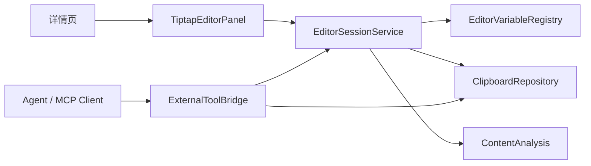

# 提案：详情页富文本编辑器与 Agent/MCP 扩展桥

## 背景

ClipForge 当前详情页已经支持 Markdown / 链接 / 代码块预览，以及代码块快速粘贴，但详情页仍是“查看和动作面板”，不支持直接编辑内容并写回剪贴板历史。

后续如果要引入动态插件脚本、Agent 辅助改写、模板变量、内容转换等能力，必须先有一个受控的编辑会话模型：

- 用户在详情页明确点击“编辑”进入编辑态。
- 编辑器能读取当前条目、来源应用、内容类型、窗口/路由、最近剪贴板上下文等变量。
- 保存时必须回填到当前剪贴板条目，并可选择同步写回系统剪贴板。
- 插件和 Agent 只能通过稳定服务接口访问编辑会话，不直接读写 React UI state。

## 目标

1. 在详情页增加“编辑”入口，支持快速修改当前剪贴板内容。
2. 引入 Tiptap 作为详情页富文本编辑器基础，优先覆盖文本 / Markdown / HTML 类内容。
3. 支持“保存并回填”：更新当前 clip 内容、重跑分析、更新搜索索引，并可一键写回系统剪贴板。
4. 定义编辑器变量机制，暴露当前编辑器可获取的环境与变量信息。
5. 为后续插件脚本和 Agent/MCP 对接定义桥接边界与工具名称。

## 非目标

- 不把 ClipForge 改造成 AI 工作台或复杂知识库。
- 不在第一阶段实现远程插件市场、远程代码执行或后台自动改写。
- 不让插件直接访问 SQLite、React store、localStorage 或系统剪贴板原生 API。
- 不默认把全部剪贴板历史暴露给编辑器变量或 Agent。
- 不在第一阶段实现多人协同编辑、评论、云同步或 Tiptap Cloud 能力。

## 用户价值

- 用户复制一段 Markdown、命令、提示词或富文本后，可以在详情页快速修正并直接粘贴。
- 变量机制让模板和插件能明确知道“当前内容是什么、来自哪个应用、当前目标是什么”，减少手工复制上下文。
- Agent/MCP 只作为可选外部能力接入，不影响剪贴板工具的快速主路径。

## 技术调研结论

### Tiptap

根据 Context7 拉取的 Tiptap 当前文档：

- React 接入使用 `@tiptap/react` 的 `useEditor` 和 `EditorContent`。
- 基础扩展可用 `@tiptap/starter-kit`，也可以按需组合 Document / Paragraph / Text 等扩展。
- 编辑器内容可以通过 `editor.getJSON()` 获取结构化文档，通过 `editor.getHTML()` 获取 HTML，通过 `editor.getText()` 获取纯文本。
- 自定义扩展可通过生命周期事件（如 `onUpdate`、`onSelectionUpdate`、`onFocus`、`onBlur`）接入状态同步。
- 自定义扩展支持 `addStorage()` 保存可变运行时数据，适合挂载只读变量 registry 或编辑会话元数据。

结论：Tiptap 适合承担详情页受控富文本编辑器，但 Markdown 原文的高保真往返不是 StarterKit 的内置能力，需要单独设计 Markdown 导入/导出策略。

### MCP/Agent

仓库现有架构已定义：

- MCP 是标准工具入口，不和 UI 状态强耦合。
- Agent、CLI、MCP server 只能通过统一服务契约访问剪贴板数据。
- 当前基础工具包括 `clipboard.capture`、`clipboard.search`、`clipboard.copy`、`clipboard.update` 等。

本提案延续该边界：编辑器会话通过独立 EditorSessionService 暴露，MCP/Agent 调用服务层，不直接操作 React 组件。

## 方案概览

## 交互设计

### 详情页新增动作

- 顶部快捷操作新增“编辑”按钮。
- 点击后详情页从预览态切换到编辑态。
- 编辑态顶部动作：
  - `保存`：更新当前 clip，停留编辑态。
  - `保存并复制`：更新当前 clip，并写回系统剪贴板。
  - `保存并粘贴`：更新当前 clip，并调用现有粘贴链路。
  - `取消`：放弃本次编辑，回到预览态。
  - `变量`：打开只读变量抽屉。

### 编辑对象

第一阶段支持：

- `payloadKind=text`
- `payloadKind=markdown`
- `payloadKind=html`
- `kind=code` / `kind=command` 走代码/纯文本编辑模式。

暂不支持：

- 图片原图编辑。
- 文件列表编辑。
- RTF 高保真编辑。

## 风险与约束

- Markdown 高保真往返存在风险：Tiptap 原生以 ProseMirror JSON / HTML 为主，Markdown 需要明确转换策略。
- 编辑器 bundle 体积会上升，需要延迟加载编辑器面板，避免影响快速面板首屏。
- 变量上下文不能无边界暴露敏感内容，应默认只暴露当前 clip 元数据与显式选中的上下文。
- Agent 修改必须走预览/确认/应用三步，不能后台自动改写剪贴板。

## 建议推进顺序

1. 先实现本地详情编辑和回填，不接 Agent。
2. 再实现变量抽屉和变量 registry。
3. 最后接 MCP/Agent 工具，所有外部修改先返回 patch 预览。

