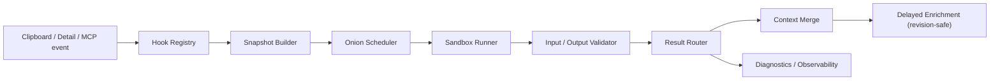

# 设计：外部 Hook 插件运行时（Block A：读取侧收敛）

> 2026-07-30 精简：本设计切为 Block A（读取侧，可推进）与 Block B（写入侧，冻结）。Block B 的 Proposal / Apply / `clipboard.content.write` 仅保留设计记录，不在本 change 实现。写入侧设计与现状的 collector 只读能力对齐：现状没有写入风险，Block B 是为未来真实需求预留边界。

## 0. Block 划分与冻结策略

| Block | 范围 | 状态 | 触发解冻条件 |
| --- | --- | --- | --- |
| A | 统一 Hook manifest V2、4 态生命周期、洋葱 priority、沙盒校验、节流、熔断、延迟补写、单个 MCP 试运行工具、collector v1 read-only adapter | 可推进 | 无前置，依赖剪贴板核心稳定即可 |
| B | `content.propose`、Proposal Store、Host Apply Service、revision-safe writeback、`clipboard.hook.apply`、`clipboard.content.write` | 冻结 | 出现“外部脚本需要改写剪贴板内容”的真实用户故事，另立 change |

Block A 落地后，`clipboard.context.*` 兼容入口按 deprecation 时间表（建议保留 2 个 minor 版本）逐步由 `clipboard.hook.*` 承载。

## 1. 架构边界



### 组件职责

| 组件 | 职责 | 明确禁止 |
| --- | --- | --- |
| `HookRegistry` | 加载、校验、排序、启停 manifest；维护 4 态 | 执行外部代码 |
| `SnapshotBuilder` | 构造脱敏、限长、带权限的输入快照 | 读取未授权正文或 session |
| `OnionScheduler` | 匹配多个 Hook、按 priority 串行传递上下文、节流 | 并行写宿主状态、超量触发 |
| `SandboxRunner` | 启动隔离子进程、限制 stdin/stdout/stderr/时间 | shell 拼接、继承全部环境 |
| `ResultValidator` | 校验协议、字段、大小、MIME、哈希和能力 | 放行未声明动作 |
| `ContextMerge` | 合并 context patch（只补不覆盖） | 覆盖高可信宿主字段 |
| `Diagnostics` | 记录 traceId、耗时、redaction 摘要、错误码 | 记录完整正文或敏感字段 |

Block B 解冻后追加 `ProposalStore` 与 `HostApplyService`，本设计不展开其内部状态机。

## 2. Hook 类型与能力

### Runtime 类型

| Runtime | 说明 | Block A |
| --- | --- | --- |
| `builtin` | Rust 内置 Hook，不启动外部进程 | 保留当前应用、浏览器、编辑器、终端、Finder 采集 |
| `script` | 本地目录中的 JSON stdio 脚本 | 支持，默认禁用外部执行 |
| `mcp` | 外部 MCP server 的受控工具适配 | 只定义 adapter，后置 |
| `agent` | Agent 生成或调用的 Hook 草稿 | 只能 draft，不能静默启用 |

### Capability 类型（Block A 只开放读取）

```text
context.read       读取宿主授权的元数据和摘要
context.patch      返回结构化上下文补丁
response.emit      返回声明式响应或状态建议
content.propose    （Block B，冻结）生成候选内容
clipboard.write    始终不作为外部脚本直接 capability；只有宿主可写
```

Block A 的 manifest 只允许声明 `context.read` / `context.patch` / `response.emit`。声明 `content.propose` 的 manifest 在 Block A 阶段校验为非法。

## 3. 生命周期（4 态）

```mermaid
stateDiagram-v2
  [*] --> enabled: manifest loaded and user enabled
  enabled --> disabled: user / kill switch
  disabled --> enabled: user re-enable
  enabled --> error: single execution failed
  error --> enabled: next run after recovery
  error --> circuit-broken: failure threshold reached
  circuit-broken --> enabled: recovery window elapsed
  circuit-broken --> disabled: user / kill switch
```

| 状态 | 是否继续主流程 | 记录内容 |
| --- | --- | --- |
| `enabled` | 是 | manifest identity、effective policy |
| `disabled` | 是 | reason（用户 / kill switch） |
| `error` | 是 | 单次错误码、耗时、traceId |
| `circuit-broken` | 是 | 连续失败计数、熔断到期时间 |

> 说明：原 11 态生命周期（registered/validated/armed/running/proposal-created/applied/…）在 Block A 收敛为以上 4 态。`running` 是瞬时执行态不单独持久化；`proposal-created` / `applied` 属于 Block B，冻结。

## 4. Manifest V2

```json
{
  "protocol": "clipforge.application-hook.v1",
  "schemaVersion": 1,
  "id": "browser.chrome.active-tab",
  "name": "Chrome active tab",
  "version": "0.2.0",
  "runtime": "script",
  "enabled": true,
  "priority": 100,
  "triggers": ["clipboard.captured", "mcp.run"],
  "capabilities": ["context.read", "context.patch"],
  "command": "./hook.sh",
  "match": { "bundleIds": ["com.google.Chrome"] },
  "permissions": ["automation"],
  "sandbox": { "shell": false, "network": false, "filesystem": "none" },
  "limits": {
    "timeoutMs": 500,
    "maxInputBytes": 65536,
    "maxOutputBytes": 65536,
    "maxStderrBytes": 4096
  }
}
```

### Manifest 校验（Block A）

- `id/name/version/schemaVersion` 必填，id 只能使用稳定字符集。
- `command` 必须解析到 Hook 目录内部的文件（现状 `resolve_executable` 已实现路径越界校验）。
- `match.bundleIds` 或 `match.appNames` 至少声明一个。
- `priority` 默认 `100`，数值越小越先执行。
- `triggers` 和 `capabilities` 只能使用宿主支持的枚举；Block A 阶段 `content.propose` / `clipboard.write` 非法。
- 超时和输出大小不能超过宿主硬上限（现状 `clamp` 已实现）。
- 权限扩大重新确认：Block A 阶段不实现持久化指纹，外部脚本默认禁用 + 用户手动启用即可；权限扩大校验后置到 Block B 解冻时。

## 5. 洋葱执行模型（简化）

现状 `collect_external_contexts` 已实现 priority 排序 + `collectedContext` 前序传递 + `merge_context`（只补不覆盖）。Block A 只在此基础上补分层 provenance，不引入复杂的 conflict 诊断。

每层输入（沿用现状 `collector_input`）：

```json
{
  "protocol": "clipforge.application-hook.v1",
  "schemaVersion": 1,
  "application": {},
  "window": {},
  "process": {},
  "collectedContext": {},
  "environment": { "platform": "macos", "arch": "aarch64", "appVersion": "0.1.0" }
}
```

合并规则（精简）：

1. 宿主基础字段优先于外部字段；外部 patch 只能追加缺失叶子，不能覆盖已存在值。
2. 先执行的低 priority Hook 的结果进入 `collectedContext`，供后续层读取。
3. 单层失败不阻断后续层；后续层收到上一层成功结果和失败摘要。
4. 最终 snapshot 保留 `applicationContext`、`hookResults`（按层）和 `diagnostics`，不丢失分层 provenance。

> 说明：原设计的 `context-conflict` 诊断、对象递归合并的冲突仲裁在 Block A 砍掉。现实里同一应用挂 2+ 外部 Hook 的概率极低，简单“只补不覆盖”已足够；真出现高频冲突再加诊断。

## 6. 沙盒、节流与稳定性

### 进程隔离（现状已具备）

- 使用直接 argv 启动，不经过 shell（`run_json_command` 已实现）。
- stdin 只写入一份 JSON 快照，stdout 只接受一个 JSON 对象。
- 子进程使用最小环境变量集合，不继承 secret、完整 PATH 或 MCP client 环境。
- command、工作目录和 manifest 路径必须位于批准目录（`load_manifest` 已做 canonicalize + starts_with）。
- 读写通道分别限制：输入 64 KiB、输出 64 KiB、stderr 4 KiB。
- 单层默认 500ms。

### 节流（Block A 新增）

现状缺少单次捕获的触发上限和频率控制。Block A 补：

- 单次剪贴板捕获最多触发 `N=8` 个 Hook。
- 单条捕获的总链路预算默认 1500ms。
- 最小触发间隔跟随剪贴板写回抑制窗口（~450–700ms），避免一次复制连续 spawn 多轮子进程。
- 超出上限的 Hook 标记 `skipped` 并记录诊断，不抛错。

### 熔断与兜底

- `timeout`、非零退出、非法 JSON、schema error、权限拒绝分别记录错误码。
- 默认 `3 次失败 / 5 分钟` 单 Hook 熔断；熔断只影响该 Hook，不影响内置 Hook 和剪贴板功能。
- kill switch（全局）可一键禁用所有外部 Hook。
- 外部 Hook 执行线程与主窗口线程分离（现状 `schedule_delayed_collection` 已独立线程）。
- 异步写入使用 `expectedRevision`（现状 `persist_delayed_collection` 已做删除竞态处理）。

## 7. 延迟采集与补写

剪贴板捕获分两阶段（现状已实现核心链路）：

```text
T0: 读取剪贴板 + 基础应用信息
T1: 基础条目落库，collectors.status=pending
T2: 后台 Hook 链执行（受节流与熔断约束）
T3: 校验并合并 applicationContext
T4: 按 revision 补写 capture_context_json
```

规则：

- `captureExternalContextOnClipboard` 默认关闭，开启还需要 `enableExternalContextCollectors=true`。
- 延迟任务不拥有 UI 生命周期依赖，应用退出时未完成任务直接取消。
- 写入状态为 `not-requested`、`pending`、`complete`、`partial`、`failed`、`skipped`。
- 详情页和 MCP 读取到 `pending` 时展示基础上下文，不等待后台结果。

## 8. 内容 Proposal 与回写（Block B，冻结）

> 本节为冻结的设计记录，不在本 change 实现。解冻时另立 change 补：Proposal Store + TTL + client 绑定、Host Apply Service、revision/幂等/双写、`clipboard.hook.apply` 与 `clipboard.content.write`、`systemClipboard` 与 `both` 默认要求用户确认。

冻结原因：现状 collector 完全只读，没有“外部脚本改写剪贴板内容”的真实用户故事。预先实现整套 Proposal/Apply 基础设施属于预防性过度设计。一条架构规则“外部脚本不写，写入只走宿主命令”在 Block A 阶段即可守住边界。

## 9. MCP Surface（Block A 精简）

| 工具 | 作用 | 写入权限 |
| --- | --- | --- |
| `clipboard.hook.run` | 试运行匹配 Hook，返回上下文、分层 provenance 和诊断 | 无 |
| `clipboard.context.live` | 兼容：实时快照 | 无 |
| `clipboard.context.collectors.list` | 兼容：列出 collector | 无 |
| `clipboard.context.collector.debug` | 兼容：调试 collector | 无 |

Block A 只新增 `clipboard.hook.run` 一个工具。原设计的 `clipboard.hook.contract` / `clipboard.hook.debug` / `clipboard.hook.proposals` / `clipboard.hook.apply` / `clipboard.content.write` 推迟到 Block B 或确有需要时再加，避免 MCP 工具面爆炸。

### 兼容入口 deprecation

- `clipboard.context.*` 在 Block A 落地后保留（建议 2 个 minor 版本）。
- 保留期内 `clipboard.hook.run` 与 `clipboard.context.*` 并存，文档明确推荐前者。
- 保留期结束后 `clipboard.context.collector.debug` 标记 deprecated，仅 `clipboard.hook.run` 承载试运行能力。

所有 MCP 返回统一 envelope：

```json
{
  "ok": true,
  "traceId": "mcp_001",
  "businessChain": "mcp -> hook-runtime",
  "permissionDecision": { "decision": "allow", "reason": "read-only" },
  "redactedFields": [],
  "result": {}
}
```

## 10. 可观测性

日志允许记录：`traceId`、`requestId`、`hookId`、版本、状态、耗时、输入/输出字节数、字段名、redaction 数量和错误码。

日志禁止记录：完整剪贴板正文、HTML、图片内容、文件正文、prompt、transcript、token、cookie、password、authorization、secret 和 API key。

所有日志遵循项目标准化 JSONL 格式 `{ts,level,module,event,fields,msg}`（见记忆 `[[standardized-log-format]]`），`module` 固定为 `hook-runtime` 或 `context-collector-async`。

## 11. 兼容迁移

### Collector v1 read-only adapter

现有 collector v1 通过适配器映射（现状已基本对齐）：

| Collector v1 | Hook v1 |
| --- | --- |
| `command` | `entry.command` |
| `match` | `match` |
| `permissions` | `permissions` |
| `context` | `contextPatch` |
| `signals` | `responses.signals` |
| `confidence` | `confidence` |

旧 collector 在 Block A 阶段只拥有 `context.read/context.patch`，不会自动获得任何写入能力。

### 迁移策略

1. Registry 同时发现 v1 collector 和 v1 Hook manifest。
2. 旧 collector 继续通过 `clipboard.context.*` 运行。
3. 新 Hook 通过 `clipboard.hook.run` 运行。
4. Chrome 示例迁移完成并有回归测试后，才标记 collector v1 为 legacy。
5. 删除旧入口前必须完成真实 macOS Automation、超时、权限验证。

## 12. 验证矩阵（Block A）

| 领域 | 必须验证 |
| --- | --- |
| Registry | manifest 解析、路径越界、版本、排序、4 态转换 |
| Runner | shell 禁止、超时、退出码、stdout/stderr 上限、环境裁剪（现状已覆盖，回归） |
| Onion | 多 Hook、priority、前序 context、单层失败继续、分层 provenance |
| Validator | schema、MIME、长度、哈希、敏感字段、未知 action |
| Throttle | 单次捕获 Hook 上限、总链路预算、最小触发间隔 |
| Circuit | 连续失败熔断、恢复窗口、kill switch |
| Async | 基础条目先返回、pending 补写、删除竞态、应用退出 |
| MCP | `clipboard.hook.run` envelope、兼容入口并存 |
| Stability | Hook 崩溃不影响监听、主面板、搜索、详情、复制 |
| Security | prompt/token/cookie/password/secret 等字段递归脱敏 |
