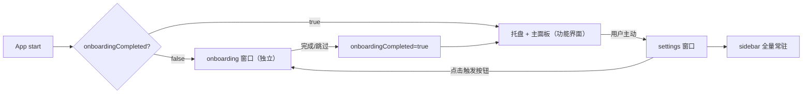

# 设计：引导页面独立化（Eco 模式）与设置页配套优化

## 1. 架构总览



两个独立 Tauri 窗口并存：

| 窗口 | label | 入口 | 职责 |
| --- | --- | --- | --- |
| 设置页 | `settings` | `settings.html` → `settings-main.tsx` | 设置管理；sidebar 全量常驻；仅放“打开引导”触发按钮 |
| 引导页 | `onboarding`（新增） | `onboarding.html`（新增）→ `onboarding-main.tsx`（新增） | Eco 风格沉浸式分步引导 |

功能界面（主面板 `main` 窗口 + 托盘）始终可达，不被引导窗口阻塞。

## 2. 引导独立窗口

### 2.1 窗口创建（复用 settings 模式）

参考 `lib.rs::open_settings_window_internal`，新增：

- `open_onboarding_window_internal`：用 `WebviewWindowBuilder::new(&app, "onboarding", WebviewUrl::App("onboarding.html".into()))` 创建；若已存在则 focus。
- `open_onboarding_window` 命令注册到 `tauri::generate_handler!`。
- `tauri.conf.json` 增加 `onboarding` 窗口配置：`label: "onboarding"`，`url: "onboarding.html"`，固定尺寸（建议 `640x560`），`resizable: false`，`decorations: true`，`center`。

### 2.2 前端入口

- `onboarding.html`（新增，仿 `settings.html`）。
- `src/onboarding-main.tsx`（新增，仿 `settings-main.tsx`）：挂载 `OnboardingApp`。
- `OnboardingWizard` 从 `src/settings/onboarding-wizard.tsx` 迁到 `src/onboarding/OnboardingApp.tsx`，去掉对设置页 sidebar/header/scroll 容器的依赖，改为沉浸式分步布局。

### 2.3 Eco 风格视觉

- 独立窗口、居中、分步指示器（小圆点，当前高亮）。
- 每步：标题 + 说明 + 主操作区（权限开关 / 采集 toggle / 快捷键录制）。
- 权限状态：未开启红色警告 + “开启权限”按钮；已开启绿色勾选。
- 主按钮（下一步/完成）深色背景；辅按钮（上一步/跳过）浅色。
- 步骤切换淡入淡出；权限状态变化脉冲；按钮 hover 轻微缩放。
- 复用已 vendored 的 Animate UI / Radix / lucide，不引入新动画库。

### 2.4 步骤沿用 archived 提案

保留五步：`welcome / accessibility / capture / shortcut / tour`（i18n key 沿用 `settings.onboarding.step.*`，后续可加 `onboarding.step.*` 专属 key）。

## 3. 设置页触发按钮

`settings.tsx` 的 `shortcut-language` section `onboarding` tab 改造：

```text
┌─ 入门引导（tab 内容）─────────────────────┐
│ 引导状态：[已完成 ✓ / 未完成]              │
│ [ 打开引导 ]   ← 调用 open_onboarding_window │
│ 提示：可随时重新查看引导内容                │
└──────────────────────────────────────────┘
```

- 移除 `<OnboardingWizard ... />` 内嵌渲染（`settings.tsx:1022-1031`）。
- 新增轻量 `OnboardingEntryCard`（状态摘要 + 触发按钮），放在 `src/settings/components/`。
- 触发按钮调用 `invoke("open_onboarding_window")`。
- 状态读取复用 `state.settings.onboardingCompleted`。

## 4. 首启动自动判断

### 4.1 推荐流程

```text
应用启动 → 读取 settings + 后台检查辅助功能权限
  → onboardingCompleted === false 且 onboardingShownAt 为空且权限缺失
     → 打开 onboarding 窗口（独立）
     → 记录 onboardingShownAt = now（避免下次再自动弹）
  → onboardingCompleted === true
     → 不自动打开
托盘 + 全局快捷键 + 主面板 → 始终可达（不被引导窗口阻塞）
```

- 在 `setup_app()` 或启动检测处，后台检查辅助功能权限；只有权限缺失且 `onboardingCompleted=false`、`onboardingShownAt` 为空时调用 `open_onboarding_window`。
- 引导窗口完成/跳过 → `updateSettings({ onboardingCompleted: true })` → 关闭窗口。
- 用户中途关闭未完成：已记 `onboardingShownAt`，下次启动不再自动弹；可从设置页触发按钮重入。

### 4.2 不阻塞功能界面

- `onboarding` 窗口是普通独立窗口，不模态绑架主进程。
- 托盘菜单、全局快捷键、`main` 窗口（主面板）的唤起逻辑不受影响。
- 引导窗口与主面板可同时存在；用户可先关引导再用快捷键唤起主面板。

## 5. sidebar 全量常驻

### 5.1 改动点

- `src/settings/components/SettingsSidebar.tsx`：`collapsible` 默认值从 `"icon"` 改为 `"none"`。
- `src/settings.tsx:982-998`：移除 `SettingsSidebar` 的 `!absolute !inset-y-0 !h-full` className，改为常规文档流、固定宽度常驻。
- `src/settings.tsx:1004-1008`：移除 `SidebarTrigger`（折叠语义不再需要）。
- 内容区 `SidebarInset` 保持 `flex-1 overflow-auto`。

### 5.2 布局效果

```text
┌──────────────┬───────────────────────────┐
│  ClipForge   │  Section Header           │
│  ─────────   │  ─────────────────────    │
│  > 常规      │                           │
│    采集      │   内容区（滚动）           │
│    外观      │                           │
│    快捷键/语言│                          │
│    Agent     │                           │
│    高级      │                           │
│  （全量可见） │                           │
└──────────────┴───────────────────────────┘
```

### 5.3 响应式降级

- 窗口宽度 >= 阈值：sidebar 固定宽度（如 `220px`）+ 内容区自适应。
- 窗口过窄：保证 sidebar 最小可读宽度（不折叠成 icon），内容区横向滚动；不出现遮挡。
- sidebar 内容超出视口高度时纵向滚动（`SidebarContent` 已支持）。

## 6. 显示与兜底策略

### 6.1 统一 fallback 状态

为每个 section 引入四态兜底组件 `SettingsSectionFallback`：

| 状态 | 触发 | 展示 |
| --- | --- | --- |
| `loading` | section 数据/权限读取中 | 骨架屏 + loading 文案 |
| `error` | 读取失败、命令报错 | 错误图标 + 摘要 + “重试”按钮 |
| `permission-missing` | 辅助功能等权限缺失 | Eco 风格“下一步”提示 + “去系统设置开启” + “刷新检测” |
| `empty` | 该 section 无可用数据（如无 provider） | 空态插画 + 引导文案 + 主操作 |

### 6.2 错误边界

- 为设置页与引导页各包一层 React Error Boundary，捕获渲染异常 → 显示兜底 UI + “重置/重试”，避免白屏。
- 边界捕获的异常落标准化日志（`event: render-error`）。

### 6.3 窗口过窄兜底

- CSS 媒体查询 / 容器查询：窗口 < 最小宽度时切换为“紧凑布局”（sidebar 最小宽度 + 内容横向滚动），不折叠 sidebar、不遮挡。

### 6.4 引导窗口兜底

- 权限检测失败：引导对应步骤进入 `permission-missing` 态，提供“去系统设置”+“刷新”。
- 设置保存失败：步骤底部显示错误条 + 重试，不阻断后续步骤浏览。

## 7. 日志策略

所有日志遵循项目标准化 JSONL 格式 `{ts,level,module,event,fields,msg}`（见 `[[standardized-log-format]]`）。

### 7.1 事件清单

| module | event | 触发 | fields（摘要，不含敏感值） |
| --- | --- | --- | --- |
| `onboarding-window` | `onboarding.open` | 引导窗口打开 | source(`auto`/`manual`)、hasShownAt |
| `onboarding-window` | `onboarding.step` | 步骤切换 | step、durationMs |
| `onboarding-window` | `onboarding.complete` | 完成/跳过 | completed(bool)、skipped(bool) |
| `onboarding-window` | `permission.check` | 权限检测 | status(`granted`/`missing`/`denied`) |
| `settings-window` | `settings.section` | section 切换 | section、durationMs |
| `settings-window` | `settings.changed` | 设置写入完成 | keys（仅 key 名）、durationMs、revision |
| `settings-window` | `fallback.shown` | 兜底命中 | section、state(`error`/`permission-missing`/`empty`) |
| `settings-window` | `render-error` | 渲染异常捕获 | section、errorSummary |

### 7.2 禁止记录

- 设置值原文（尤其 agent provider token、API key、快捷键完整序列可记名不记值）。
- 权限 token、cookie、authorization。
- 剪贴板正文、引导中用户输入的实际内容。
- 只记 key 名、状态、耗时、计数，不记 value。

### 7.3 性能采样

- 沿用 `window.__clipforgePerf`，新增/复用子项：`onboarding.step`、`settings.section`、`settings.changed`、`onboarding.open`。
- P95 目标：`onboarding.open` 与 `settings.section` 反馈 <= 300ms（对齐 roadmap 性能要求）。

## 8. 文件结构（实现指引，不在本提案写代码）

```text
src/
  onboarding.html               （新增）
  onboarding-main.tsx           （新增）
  onboarding/
    OnboardingApp.tsx           （从 settings/onboarding-wizard.tsx 迁入并改造）
    OnboardingStepper.tsx       （新增，分步指示器与切换）
    onboarding.css              （新增，Eco 风格样式，surface scoped）
  settings/
    components/
      OnboardingEntryCard.tsx   （新增，设置页触发按钮卡片）
      SettingsSectionFallback.tsx（新增，四态兜底）
  settings.tsx                  （改造：移除内嵌 wizard、sidebar 全量、挂兜底）
  settings.css                  （改造：sidebar 全量样式、过窄降级）

src-tauri/
  src/lib.rs                    （新增 open_onboarding_window_internal / 命令注册）
  tauri.conf.json               （新增 onboarding 窗口配置）
```

样式按 `frontend-surface-architecture-refactor` 的 surface scoped styles 拆分，不在 `src/App.css` 追加全局样式。

## 9. 验证矩阵

| 领域 | 必须验证 |
| --- | --- |
| 引导窗口 | 独立打开、五步切换、权限检测、完成/跳过、关闭后重入 |
| 首启动 | `onboardingCompleted=false` 自动弹；`onboardingShownAt` 后不再自动弹；托盘/快捷键不阻塞 |
| 设置页触发 | tab 仅显示状态 + 按钮；按钮打开引导窗口；状态随完成态更新 |
| sidebar | 全量常驻、无 icon 折叠、无浮动遮挡；过窄降级不遮挡 |
| 兜底 | loading / error / permission-missing / empty 四态；Error Boundary；窄窗口 |
| 日志 | 导航/保存/兜底/性能 JSONL；不含敏感值 |
| 性能 | `onboarding.open` / `settings.section` P95 <= 300ms |
| 兼容 | 现有 `onboardingCompleted` 读写、设置保存、i18n 不回归 |

## 10. 演示素材关联

引导的 `tour`（功能介绍）步骤可引用 `project-demo-gif-pipeline` 产出的功能演示动图（真实录屏 gif，如 `docs/demos/demo-quick-open.gif`），或复用 Remotion workbench 渲染的 `onboarding` 动画（`pnpm motion:render:onboarding`，输出 `docs/demos/onboarding.mp4`）。素材存放、命名与转码流水线以 `project-demo-gif-pipeline` 为准，本提案不重复定义。
