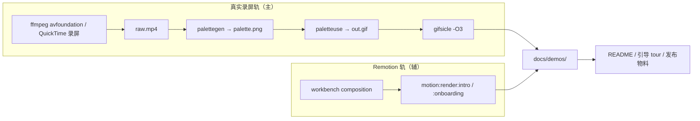

# 设计：项目功能演示动图生成流水线

## 1. 双轨架构



## 2. 真实录屏转 gif 流水线

### 2.1 录屏（macOS）

- 方式 A（脚本化）：`ffmpeg -f avfoundation -framerate 30 -i "1:" raw.mp4`，其中视频设备 `1` 通常为屏幕录制设备（用 `ffmpeg -f avfoundation -list_devices true -i ""` 确认索引）。
- 方式 B（手动）：QuickTime 录屏 → 导出 `raw.mov/mp4` → 喂给转码脚本。
- 录制前：关闭通知、Do Not Disturb、隐藏桌面图标，避免敏感信息入镜。

### 2.2 调色板两步法（高质量 gif）

```bash
# 1. 生成调色板
ffmpeg -i raw.mp4 -vf "fps=15,scale=960:-1:flags=lanczos,palettegen" palette.png

# 2. 用调色板转 gif
ffmpeg -i raw.mp4 -i palette.png \
  -lavfi "fps=15,scale=960:-1:flags=lanczos [x]; [x][1:v] paletteuse" \
  out.gif
```

### 2.3 优化与裁剪

```bash
# gifsicle 优化体积
gifsicle -O3 --colors 128 out.gif -o out.gif

# 可选裁剪（只保留面板区域，例 420x400 起点在 100,80）
ffmpeg -i raw.mp4 -vf "crop=420:400:100:80,fps=15,scale=960:-1:flags=lanczos" ...
```

### 2.4 封装脚本设计

新增 `scripts/render-demo-gif.mjs`（Node，与现有 `scripts/*.mjs` 风格一致）：

- 入参：`--input raw.mp4 --output docs/demos/demo-xxx.gif --crop W:H:X:Y --fps 15 --width 960`。
- 内部顺序执行 palettegen → paletteuse → gifsicle。
- 输出体积报告；超过阈值（如 5MB）打印降级建议（降 fps 或缩宽）。
- 不强依赖全局 ffmpeg：检测 `ffmpeg`/`gifsicle` 是否存在，缺失则给出安装提示（`brew install ffmpeg gifsicle`），不静默失败。

## 3. Remotion 辅路径

- 直接复用 `package.json` 的 `motion:render:intro` 与 `motion:render:onboarding`。
- 输出默认为 mp4；如需 gif，再用 `scripts/render-demo-gif.mjs` 将 mp4 转 gif。
- Remotion 用于 README 顶部品牌动画与引导窗口的过渡动画；真实功能演示不靠 Remotion 还原 UI。

## 4. 场景清单与录制指引

新增 `docs/demos/RECORDING.md`：

- 每个场景的：目的、操作步骤、重点强调、建议时长、命名、是否需要重录的触发条件（相关 surface 变更）。
- 场景表见 proposal §3。
- 录制环境约定：macOS 版本、分辨率、主题（建议默认浅色 + 深色各一条核心场景）、是否模拟数据（用受控的假剪贴板内容，避免真实敏感信息）。

## 5. 资产目录与命名

```text
docs/demos/
  RECORDING.md            录制指引与场景清单
  demo-quick-open.gif
  demo-history.gif
  demo-search.gif
  demo-copy-paste.gif
  demo-favorites.gif
  demo-settings.gif
  demo-onboarding.gif
  intro.mp4               Remotion 渲染
  onboarding.mp4          Remotion 渲染
  README.md               素材清单与版本记录
```

命名规范：`demo-<scenario>.gif`（kebab-case）；Remotion 产物保留 `intro.mp4` / `onboarding.mp4`。每个 gif 同名 `.md` 记录录制版本与重录触发条件（可选，或统一进 `docs/demos/README.md`）。

## 6. 参数与体积规范

| 项 | 规范 |
| --- | --- |
| 宽度 | 960（或面板真实宽度） |
| 帧率 | 15fps |
| 调色板 | 128 色 |
| 单 gif 体积 | < 3–5MB |
| Remotion mp4 | 1080p，H.264，<= 10MB |

超体积处理顺序：降帧率 → 缩宽 → 裁剪时长，优先保清晰度。

## 7. README 引用方式

- 顶部主 demo：``（或 Remotion intro 截图 + 链接 mp4）。
- 功能段：每个核心能力配一条 gif。
- 引用相对路径，便于 GitHub 与本地预览。
- 在 README 增加简短“演示”小节，链接到 `docs/demos/README.md`。

## 8. 与引导/发布的联动

- `onboarding-standalone-page` 的 `tour` 步骤可内联引用 `demo-*.gif` 或 `onboarding.mp4`。
- 发布物料（`release-assets/`）可引用同一批 gif，避免多份维护。

## 9. 文件结构（实现指引，不在本提案写代码）

```text
scripts/
  render-demo-gif.mjs       新增：录屏 → 调色板 → gif → gifsicle 封装
docs/demos/
  RECORDING.md              新增：场景清单与录制指引
  README.md                 新增：素材清单与版本记录
  demo-*.gif / intro.mp4 / onboarding.mp4   录制产出
README.md                   改造：增加演示引用区
```

## 10. 验证矩阵

| 领域 | 必须验证 |
| --- | --- |
| 工具链 | ffmpeg / gifsicle 可用性检测与缺失提示 |
| 转码 | palettegen + paletteuse + gifsicle 产出可读 gif |
| 体积 | 单 gif < 5MB，超体有降级建议 |
| 场景 | 至少一条场景（quick-open）走通完整流水线 |
| Remotion | `motion:render:intro` / `:onboarding` 仍可用（回归） |
| README | 相对路径引用在 GitHub 与本地均可显示 |
| 安全 | 录制内容不含真实敏感剪贴板内容 |
